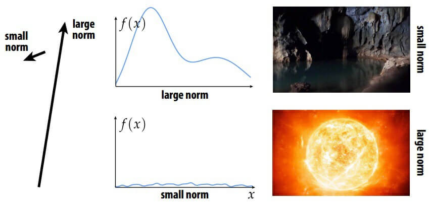
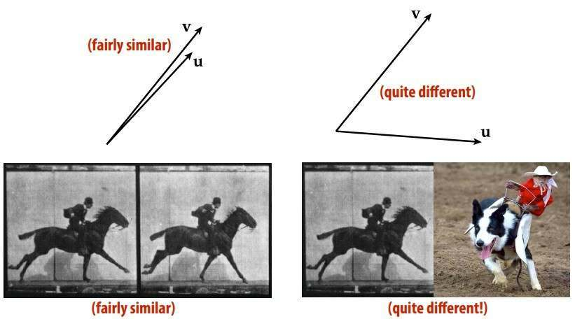
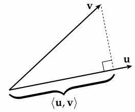
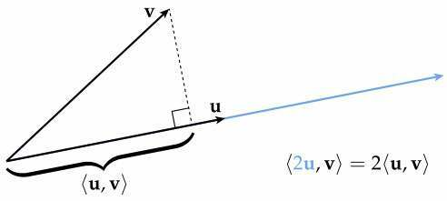
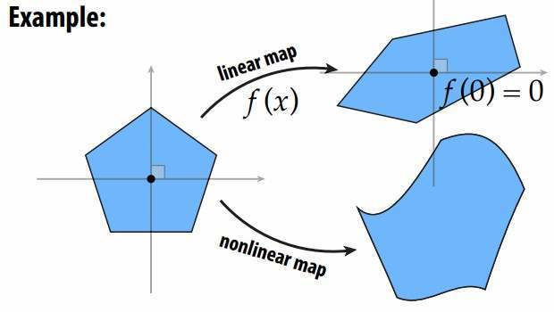
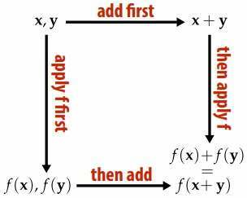
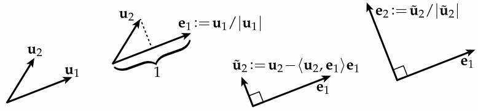
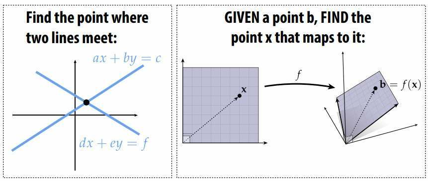
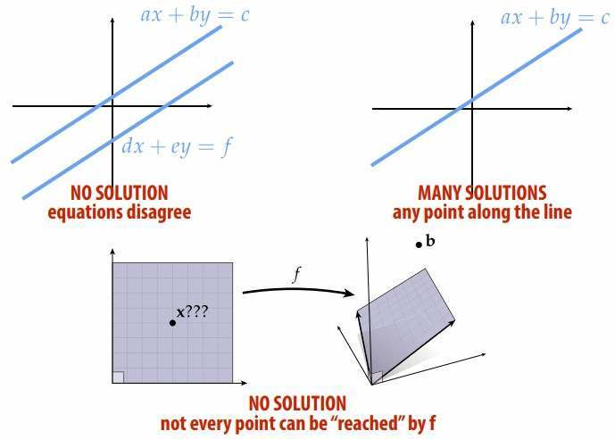

# 02. Math (P)Review Part I: Linear Algebra

**Norm**

Let’s start with magnitude—for a given vector v, we want to assign it a number |v| called its ==length== or ==magnitude== or ==norm==.
Intuitively, the norm should capture how “big” the vector is. 

A norm is any function that assigns a number to each vector and satisfies the following properties for all vectors u, v, and all scalars a: 

- Positivity: $|\mathbf{v}|\ge0,|\mathbf{v}|=0\Leftrightarrow \mathbf{v}=\mathbf{0}$
- Scale: $|a\mathbf{u}|=|a||\mathbf{u}|$
- Triangle: $|\mathbf{u}|+|\mathbf{v}|\ge|\mathbf{u}+\mathbf{v}|$

常见的模(norm)

- Euclidean norm: $|\mathbf{u}|:=|(u_1,...,u_n)|=\sqrt{\sum_{i=1}^{n}u_i^2}$
- $L^2$ norm: $||f||:=\sqrt{\int_0^1{{f(x)}^2dx}}$

**Inner Product**

In addition to magnitude, we said that vectors have orientation. Just as norm measured length, ==inner product== measures how well vectors "line up(对齐)". 

An inner product is any function that assigns to any two vectors u,v a number <u,v> satisfying the following properties: 

- Symmetry: $<\mathbf{u},\mathbf{v}>=<\mathbf{v},\mathbf{u}>$

- Projection: For unit vectors $|\mathbf{u}|=|\mathbf{v}|=1$, an inner product measures the extent(长度) of one vector along the direction of the other.

  

- Scale: If we scale either of the vectors, the inner product also scales. $\langle\mathbf{u},\mathbf{v}\rangle=a\langle\mathbf{v},\mathbf{u}\rangle$

  

- Positivity: A vector should always be aligned with itself, which we can express by saying that the inner product of a vector with itself should be positive (or at least, non-negative) $\langle \mathbf{u},\mathbf{u}\rangle\ge0$。

- $ \langle\mathbf{u}+\mathbf{v},\mathbf{w}\rangle = \langle\mathbf{u},\mathbf{w}\rangle+\langle\mathbf{v},\mathbf{w}\rangle$

常见的内积

- Euclidean inner product: $\langle\mathbf{u},\mathbf{v}\rangle=\langle(u_1,...,u_n),(v_1,...,v_n)\rangle:=\sum_{i=1}^nu_iv_i$
- $L^2$ Inner Product of Functions: $\langle{f,g}\rangle:=\int_0^1{f(x)g(x)dx}$

**Linear Map**

Linear maps take lines to lines while keeping the origin fixed

A map f is linear if it maps vectors to vectors, and if for all vectors u,v and scalars a we have 
$$
f(\mathbf{u}+\mathbf{v})=f(\mathbf{u})+f(\mathbf{v})\\
f(a\mathbf{u})=af(\mathbf{u})
$$
In other words: if it doesn’t matter whether we add the vectors and then apply the map, or apply the map and then add the vectors (and likewise for scaling): 

For maps between $R^m$ and $R^n$ (e.g., a map from 2D to 3D), we can give an even more explicit defnition. A map is linear if it can be expressed as
$$
f(u_1,...,u_m)=\sum_{i=1}^mu_i\alpha_i
$$
**Affine Maps**

Affine maps are not linear maps

Just as a linear function preserves weighted sums, an affine function f preserves ==convex combinations==. In other words, if we have some set of weights $w_1, . . . , w_n$ such that $\sum_{i=1}^n w_i = 1$, then a function f is**affine** if
$$
f(w_1x_1 + · · · + w_nx_n) = \sum_i w_i f(x_i)
$$
for any collection of vectors $x_1, . . . , x_n$

**Span**
$$
\text{span}(\mathbf{u}_1,...,\mathbf{u}_k)=\{x\in V|x=\sum_{i=1}^ka_i\mathbf{u}_i,a_1,...,a_k\in R\}
$$
The ==image== of any linear map is the span of some collection of vectors.

**Basis**

if we have exactly n vectors $e_1, ..., e_n$ such that $\text{span}(\mathbf{e}_i,...,\mathbf{e}_n) = \mathbb{R}^n$, then we say that these vectors are a basis for $R^n$

**Orthonormal Basis**

Most often, it is convenient to have to basis vectors that are (i) ==unit length== and (ii) ==mutually orthogonal==

In other words, if $e_1, …, e_n$ are our basis vectors then
$$
\langle\mathbf{e}_i,\mathbf{e}_j\rangle=\left\{
             \begin{array}{ll}
             1,&i=j\\
             0,&\text{otherwise}
             \end{array}
\right.
$$
This way, the geometric meaning of the sum $u_1^2 +…+u_n^2$ is maintained: it is the length of the vector $\mathbf{u}$.

**Gram-Schmidt**

Given a collection of basis vectors $a_1, … a_n$, how do we fnd an orthonormal basis $e_1, … e_n$?

 Gram-Schmidt algorithm:

- normalize the frst vector (i.e., divide by its length)

- subtract any component of the 1st vector from the 2nd one

- normalize the 2nd one

- repeat, removing components of frst k vectors from vector k+1

  

(==WARNING==: for large number of vectors / nearly parallel vectors, not the best algorithm )

**Fourier Transform**

functions that repeat at intervals of 2π can project onto basis of sinusoids: $\cos(nx),\sin(mx),m,n\in\mathbb{N}$

**Frequency Decomposition of Signals**

More generally, this idea of projecting a signal onto different “frequencies” is known as ==Fourier decomposition==

**System of Linear Equations**

What does solving a linear system mean? 

Of course, not all linear systems can be solved! (And even those that can be solved may not have a unique solution.) 

**Matrices in Linear Algebra**

Linear algebra often taught from the perspective of matrices, but linear algebra is not fundamentally about matrices. As you’ve just seen, you can understand almost all the basic concepts without ever touching a matrix! Likewise, matrices can interfere with understanding / lead to confusion, since the same object (a block of numbers) is used to represent many different things (linear map, quadratic form, ...) in many different bases. 

**Bilinear and Quadratic Forms**

A bilinear form is any map B from a pair of vectors to a scalar that is linear in each argument. In other words, we have both 
$$
B(a\mathbf{x}+b\mathbf{y},\mathbf{z})=aB(\mathbf{x},\mathbf{z})+bB(\mathbf{y},\mathbf{z})\\
B(\mathbf{x},a\mathbf{y}+b\mathbf{z})=aB(\mathbf{x},\mathbf{y})+bB(\mathbf{x},\mathbf{z})\\
$$
for all vectors x, y, z and scalars a, b. 

In $R^n$, any bilinear form $f : R^n × R^n \to R$ can be expressed as a homogeneous bivariate polynomial of degree 2. 

> i.e., $B(\mathbf{x},\mathbf{y})=ax_1y_1+bx_1y_2+cx_2y_1+dx_2y_2$

A quadratic form is any map $Q: R^n\to R$ that satisfies
$$
Q(a\mathbf{x})=a^2Q(\mathbf{x})
$$
for all vectors $x \in R^n$ and scalars $a \in R$. 

> i.e., $Q(\mathbf{x})=ax_1^2+bx_1x_2+cx_2^2$

Given a bilinear form B(x, y), one can always construct a corresponding quadratic form Q(x) := B(x, x).
It is also possible to go the other direction: given any quadratic form Q(x), one can construct a symmetric
bilinear form via 
$$
B(\mathbf{x},\mathbf{y}):=\frac{1}{2}(Q(\mathbf{x}+\mathbf{y})-Q(\mathbf{x})-Q(\mathbf{y}))
$$
This bilinear form has the special property that applying it to two copies of the same argument recovers the
original quadratic form:  
$$
B(\mathbf{x},\mathbf{x})=Q(\mathbf{x})
$$
