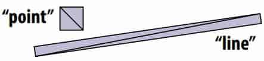
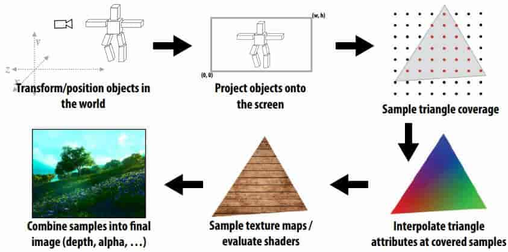
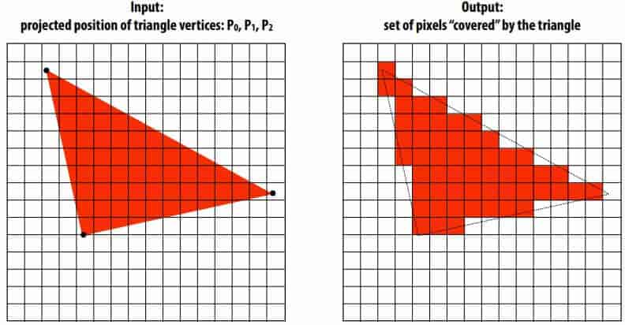
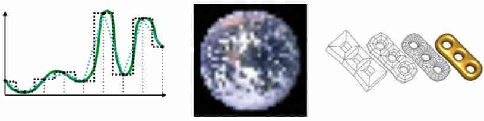
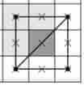
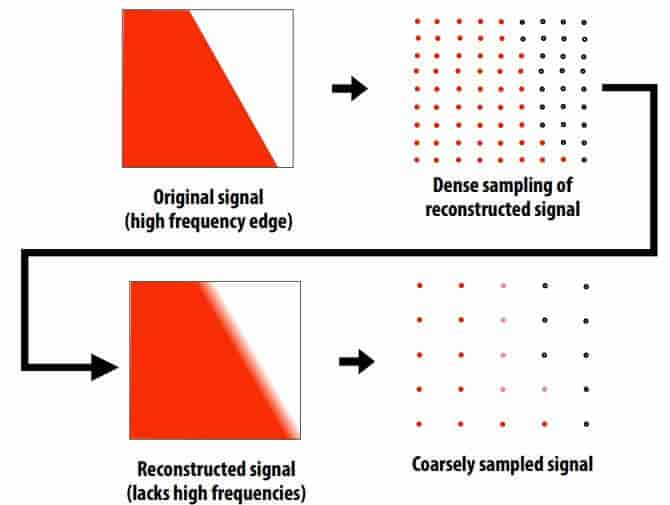
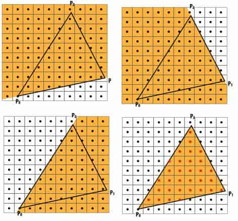
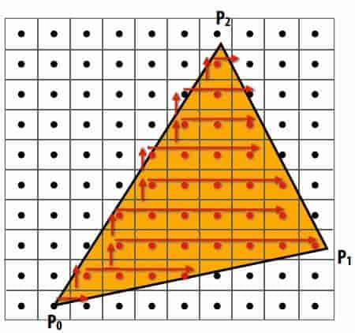
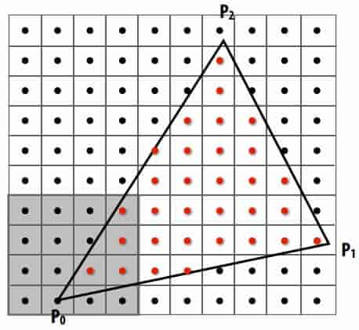

## 04 Drawing a Triangle

**Triangle**

Rasterization pipeline converts ==all== primitives to triangles 

> even points and lines! 

Why?

- can approximate any shape 
- always planar(平面的), well-defned normal 
- easy to interpolate data at corners by ==barycentric coordinates==

Key reason: once everything is reduced to triangles, can focus on making an ==extremely well-optimized pipeline== for drawing them 

**Pipeline**

**Coverage**

**Sampling**

- Sampling = measurement of a signal
  - Encode signal as discrete set of samples
  - In principle, represent values at specifc points (though hard to measure in reality!) 

- Reconstruction = generating signal from a discrete set of samples
  - Construct a function that interpolates or approximates function values

    > E.g., piecewise constant/“nearest neighbor”, or piecewise linear
    >
    > Many more possibilities! For all kinds of signals (audio, images, geometry…) 
    >
    > 

**Sampaling for coverage**
$$
\text{coverage}(x,y)=\left\{
             \begin{array}{ll}
             1,&\text{if the triangle contains point(x,y)}\\
             0,&\text{otherwise}
             \end{array}
\right.
$$

> When edge falls directly on a screen sample point, the sample is classifed as within
> triangle if the edge is a “top edge” or “left edge” 

Resampling a densely sampled signal (supersampled) integrates coverage values over the entire pixel region. The integrated result is sent to the display (and emitted by the pixel) so that the light emitted by the pixel is similar to what would be emitted in that screen region by an “infnite resolution display” 

**Aliasing**

Undersampling high-frequency signals results in aliasing 

**Nyquist-Shannon theorem**

Consider a band-limited signal: has no frequencies above $\omega_0$ 

The signal can be perfectly reconstructed if sampled with period $T=1/(2\omega_0)$

And interpolation is performed using a “sinc flter”, $\text{sinc}(x)=\frac{\sin(\pi x)}{\pi x}$

**Challenges of sampling-based approaches in graphics**

Our signals are not always band-limited in computer graphics.

infnite extent of “ideal” reconstruction flter (sinc) is impractical for efficient implementations. 

**Evaluate  $\text{coverage}(x,y)$**

- Point-in-triangle test

  > 三条边的方程，像素点位置代入方程，根据正负判断与边的位置关系

  

- Incremental triangle traversal

  

- Modern approach: tiled triangle traversal 

  