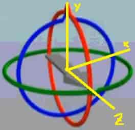
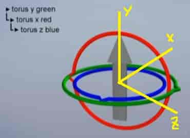
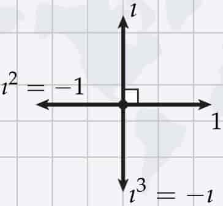
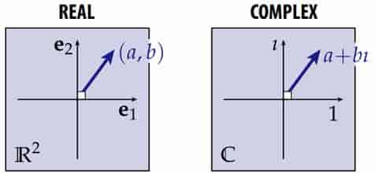
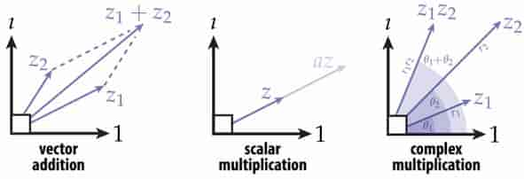
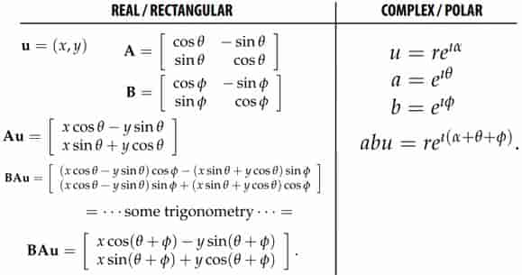
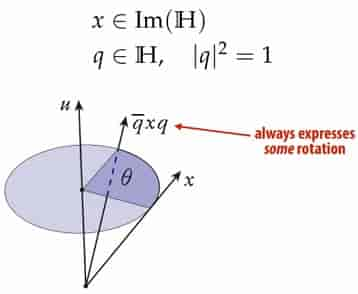
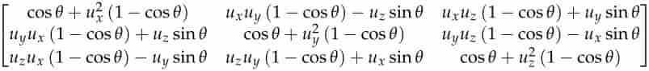
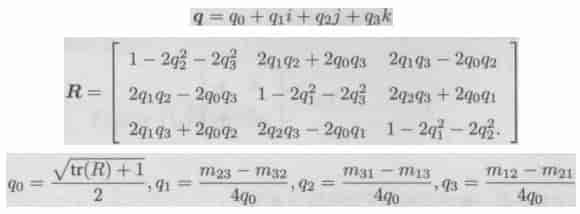
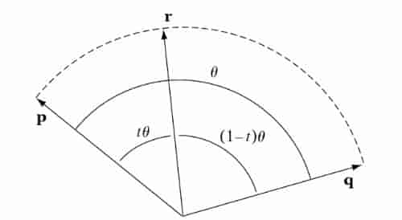

# 06 3D Rotation and Complex Representation

**Commutativity**

2D rotations are commutable, but 3D rotations are not commutable.

**Gimbal Lock**

右手系，开始时箭头指向z轴，绕x轴旋转 -90°

此时想让箭头指向 -x 轴，发现没法做到了（蓝环和绿环重合）

> 假装图片的箭头是圆锥+圆柱构成的

只能先绕x轴旋转 -90°，再向y轴旋转 90°。同时旋转，得到如下轨迹（发生了偏移）

**Imaginary Unit $i$**

~~i=sqrt{-1}~~

Imaginary unit is just a ==quarter-turn== in the counter-clockwise direction 

**Complex Numbers**

Complex numbers are then just ==2-vectors== 

Instead of $e_0$, $e_1$, use “$1$” and “$i$” to denote the two ==bases== 

Otherwise(其他方面), behaves exactly like a real 2-dimensional space 

**Complex Arithmetic**

$$
\begin{aligned}
&z_1+z_2=(a_1+a_2)+(b_1+b_2)\ i\\
&cz=ca+cb\ i\\
&z_1z_2=(r_1r_2,\theta_1+\theta_2)......\text{Polar Form}\\
&z_1z_2=(a_1+b_1\ i)(a_2+b_2\ i)=(a_1a_2-b_1b_2)+(a_1b_2+a_2b_1)\ i\\
\end{aligned}
$$
**Complex Product—Polar Form**
$$
\begin{aligned}
&e^{i\pi}=\cos\theta+i\ \sin\theta\\
&z_1=r_1e^{i\ \theta_1}\\
&z_2=r_2e^{i\ \theta_2}\\
&z_1z_2=r_1r_2e^{i\ (\theta_1+\theta_2)}\\
\end{aligned}
$$
**2D Rotations: Matrices vs. Complex**

**Quaternions**

Hamilton’s insight: in order to do 3D rotations in a way that mimics complex numbers for 2D, actually need ==FOUR coords==. 

One real, three imaginary: 
$$
\mathbb{H}:=\text{span}(\{1,i,j,k\})\\
q=a+bi+cj+dk\in\mathbb{H}
$$
Quaternion product determined by 
$$
i^2=j^2=k^2=ijk=-1
$$
>可推出 $ij=k,\ jk=i,\ ki=j$

together with “natural” rules (distributivity, associativity, etc.) 

==WARNING==: product no longer commutes! 

> For $q,p\in\mathbb{H},qp\ne pq$

**Quaternion Product in Components **
$$
\begin{aligned}
q&=a_1+b_1 i+c_1 j+d_1 k\\
p&=a_2+b_2 i+c_2 j+d_2 k\\
qp
& =a_1a_2-b_1b_2-c_1c_2-d_1d_2\\
& +(a_1b_2+b_1a_2+c_1d_2-d_1c_2)\ i\\
& +(a_1c_2-b_1d_2+c_1a_2+d_1b_2)\ j\\
& +(a_1d_2+b_1c_2-c_1b_2+d_1a_2)\ k\\
\end{aligned}
$$

> fortunately there is a (much) nicer expression

**Quaternions—Scalar + Vector Form **
$$
\begin{aligned}
&(x,y,z)\mapsto 0+xi+yj+zk\\
&(\text{scalar},\text{vector})\in\mathbb{H}\\
&(a,\mathbf{u})(b,\mathbf{v})=(ab-\mathbf{u}\cdot\mathbf{v},a\mathbf{v}+b\mathbf{u}+\mathbf{u}\times\mathbf{v})
\end{aligned}
$$
**3D Transformations via Quaternions **

> $q=(a,\mathbf{v})=(a,(b,c,d))=a+bi+cj+dk$
>
> 定义 $\langle{q,p}\rangle=a_1a_2+b_1b_2+c_1c_2+d_1d_2$
>
> 则
>
> - $|q|^2=\langle{q,q}\rangle=a^2+b^2+c^2+d^2,\ |qp|=|q||p|$
>
> - $\cos\theta=\frac{\langle{q,p}\rangle}{|q||p|}$
>
> 定义 $\overline{q}=(a,-\mathbf{v})$, 则 $q\overline{q}=|q|^2$
>
> 定义 $q^{-1}=\overline{q}/|q|^2$，则 $qq^{-1} = 1,\ (qp)^{-1}=p^{-1}q^{-1}$

Given axis u, angle θ, quaternion q representing rotation is  
$$
q=\cos\frac{\theta}{2}+\sin\frac{\theta}{2}\mathbf{u}
$$

>Much easier to remember (and manipulate) than matrix! 
>
>
>
>

**Interpolating Rotations **

4D球面线性插值
$$
\text{Slerp}(q_0,q_1,t)=q_0(q_0^{-1}q_1)^t,t\in[0,1]
$$

>
>$$
>\begin{aligned}
>\mathbf{r}(t)&=a(t)\mathbf{p}+b(t)\mathbf{q}\\
>\cos t\theta&=a(t)+b(t)\cos\theta\\
>\cos (1-t)\theta&=a(t)\cos\theta+b(t)\\
>a(t)&=\frac{\cos tθ−\cos[(1−t)θ]\cosθ}{1−cos^2θ}=\frac{\sin[(1-t)\theta]}{\sin\theta}\\
>b(t)&=\frac{\cos[(1−t)θ]-\cos tθ\cosθ}{1−cos^2θ}=\frac{\sin t\theta}{\sin\theta}\\
>\text{Slerp}(\mathbf{p},\mathbf{q},t)&=\frac{\sin [(1-t)\theta]\mathbf{p}+\sin t\theta\mathbf{q}}{\sin\theta}
>\end{aligned}
>$$
>
>**细节**
>
>- 当$\mathbf{p}$与$\mathbf{q}$夹角$\theta$大于90°时，$\cos \theta=\frac{\mathbf{p}\cdot\mathbf{q}}{|\mathbf{p}||\mathbf{q}|}<0$，则$\mathbf{p}\cdot\mathbf{q}<0$，此时插值会在4D球面上绕远路，此时可以将任一向量取反（不改变它代表的朝向）
>- 当$\theta$很小时，$\sin \theta\to0$，此时可以用简单的线性插值$\mathbf{r}(t)=(1-t)\mathbf{p}+t\mathbf{q}$，因为此时$\sin \theta\to\theta$
