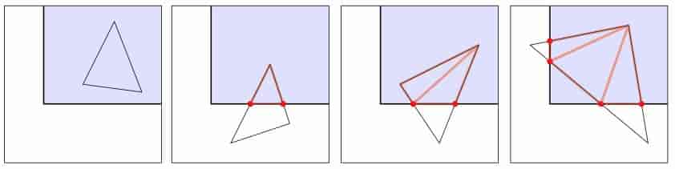
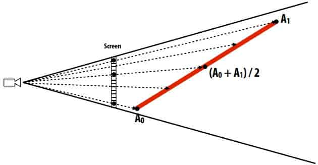
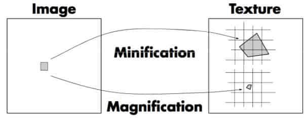
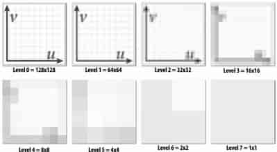
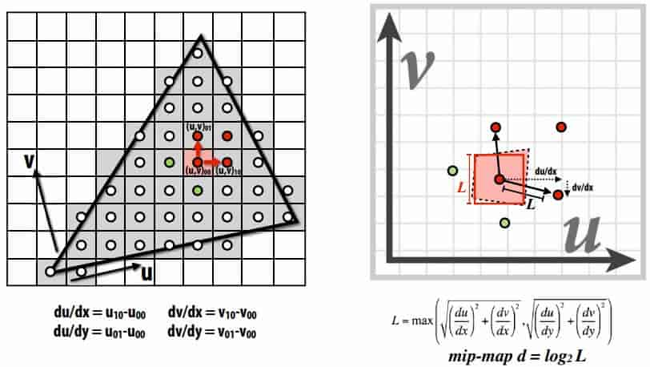
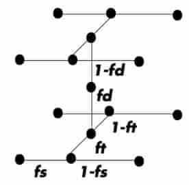
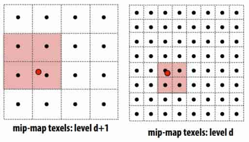
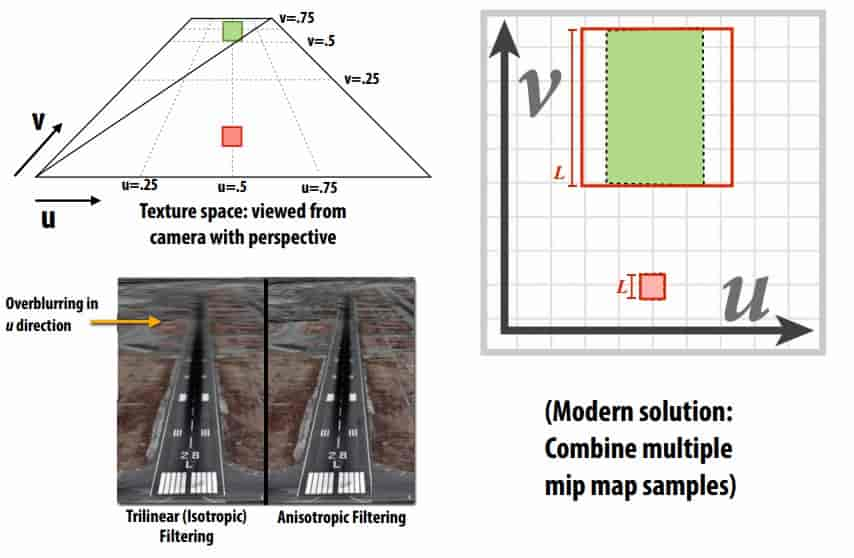

# 07 Perspective & Texture

## 7.1 Perspective Projection

**clipping**

In real-time graphics pipeline, “clipping” is the process of eliminating triangles that aren’t visible to the camera

**Near/Far Clipping**

important for dealing with fnite precision of depth buffer / limitations on storing depth as foating point values 

foating point has more “resolution” near zero 

> near/far越窄精度越高

**Matrix for Perspective Transform**
$$
\begin{bmatrix}
\frac{2n}{r-l} & 0 & \frac{r+l}{r-l} & 0 \\
0 & \frac{2n}{t-b} & \frac{t+b}{t-b} & 0 \\
0 & 0 & \frac{-(f+n)}{f-n} & \frac{-2fn}{f-n}\\
0 & 0 & -1 & 0 \\
\end{bmatrix}
$$
left (l), right (r), top (t), bottom (b), near (n), far (f) 

**Barycentric Coordinates**

$$
\phi_i(x)=\frac{\text{area}(x,x_j,x_k)}{\text{area}(x_i,x_j,x_k)}
$$

> $Attr(x)=\phi_i(x)Attr(x_i)+\phi_j(x)Attr(x_j)+\phi_k(x)Attr(x_k)$

**Perspective-incorrect interpolation**

Due to perspective projection (homogeneous divide), barycentric interpolation of values on a triangle with different depths is not an affine function of screen XY coordinates. 

Attribute values must be interpolated linearly in 3D object space. 

**Perspective Correct Interpolation**

- To interpolate some attribute ɸ…

- Compute depth z at each vertex
- Evaluate Z := 1/z and P := ɸ/z at each vertex
- Interpolate Z and P using standard (2D) barycentric coords
- At each fragment, divide interpolated P by interpolated Z to get fnal value 

> $$
> \begin{aligned}
> Z_i&=1/z_i\\
> P_i&=Attr(x_i)/z_i\\
> Attr(x)&=\frac{\phi_i(x)P_i+\phi_j(x)P_j+\phi_k(x)P_k}{\phi_i(x)
> Z_i+\phi_j(x)Z_j+\phi_k(x)Z_k}
> \end{aligned}
> $$
>

## 7.2 Texture Mapping

**101**

Basic algorithm for mapping texture to surface: 

- Interpolate U and V coordinates across triangle 
- For each fragment 
  - Sample (evaluate) texture at (U,V) 
  - Set color of fragment to sampled texture value 

sadly not this easy in general! 

**Filtering textures**

**Mipmap**

preflter texture data to remove high frequencies 

Texels at higher levels store integral of the texture function over a region of texture space (downsampled images) 

Texels at higher levels represent ==low-pass fltered== version of original texture signal 

**Compute Mipmap Level**

**Tri-linear filtering**

在两个层级之间线性插值，层级内进行双线性插值，从而形成三线性插值

**anisotropic filter**

上边是以正方形来采样，然而可能该像素代表的是一个长条，这样用正方形就过于模糊了

**Summary: texture fltering using the mip map**

- Small storage overhead (33%)

  - Mipmap is 4/3 the size of original texture image

- For each isotropically-fltered sampling operation

  - Constant fltering cost (independent of mip map level)

    > 因为已经提前计算(pre-filter)好了

  - Constant number of texels accessed (independent of mip map level)

    > 三线性插值采样8个像素

- Combat aliasing with prefltering, rather than supersampling

- Bilinear/trilinear fltering is isotropic and thus will “overblur” to avoid aliasing

- Anisotropic texture fltering provides higher image quality at higher compute and memory bandwidth cost (in practice: multiple mip map samples) 

**"Real" Texture Sampling**

1. Compute u and v from screen sample x,y (via evaluation of attribute equations)
2. Compute du/dx, du/dy, dv/dx, dv/dy differentials from screen-adjacent samples.
3. Compute mip map level d
4. Convert normalized [0,1] texture coordinate (u,v) to texture coordinates U,V in [W,H]
5. Compute required texels in window of flter
6. Load required texels (need eight texels for trilinear)
7. Perform tri-linear interpolation according to (U, V, d) 