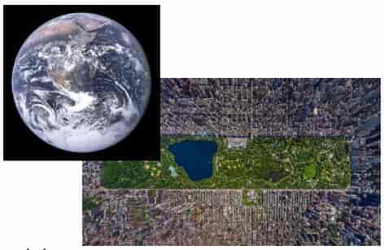
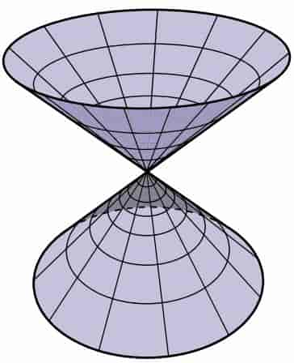
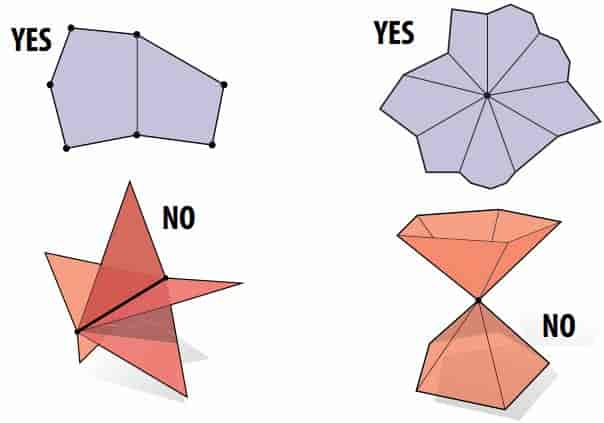
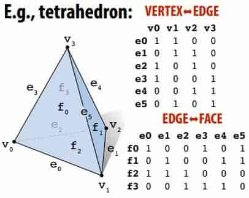
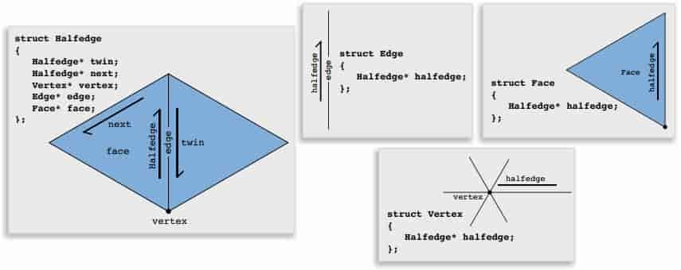
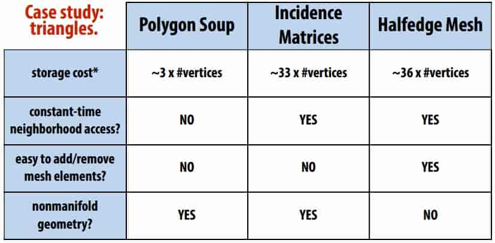
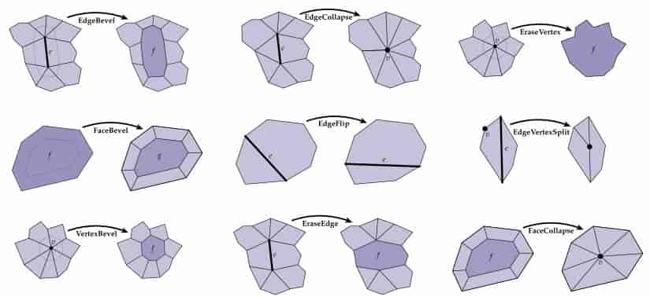

# 10 Meshes and Manifolds

## 10.1 Manifolds

**Smooth Surfaces**

Intuitively, a surface is the boundary or “shell” of an object 

Surfaces are manifold:

- If you zoom in far enough (at any point) looks like a plane* 

> *…or can easily be fattened into the plane, without cutting or ripping 
>
> 

not every shape is manifold, for instance



## 10.2 Mesh

**manifold polygon mesh**

A manifold polygon mesh has fans, not fins (鱼翅)

For polygonal surfaces just two easy conditions to check: 

- Every edge is contained in only two polygons (no “fins”) 

- The polygons containing the same vertex make a single “fan” 

  

**Polygon Soup**

- Store triples of coordinates (x,y,z), tuples of indices 
- Very expensive to fnd the neighboring triangles! 

> [What “soup” (definition) means in “triangle soup” or “polygon soup”?](https://stackoverflow.com/questions/24792749/what-soup-definition-means-in-triangle-soup-or-polygon-soup)
>
> [ahoffer](https://stackoverflow.com/users/290962/ahoffer):
>
> A polygon soup is a group of ==unorganized== triangles, with generally no relationship whatsoever. Polygon soups are a geometry storage format in a 3D modeling package, such as Maya, Houdini, or Blender. Polygon soup can help save memory, load/write time, and disk space for large polygon meshes compared to the equivalent polygon mesh.
>
> Soup is 국. In a soup, the ingredients are mixed together and are unorganized. Think of 순두부찌개. The idea is that many things are put together in an unordered or unorganized way. 

**Incidence Matrices**

Can encode all neighbor information via incidence matrices 

> example
>
> 

**Halfedge Data Structure**

- Store some information about neighbors 

- Don’t need an exhaustive list; just a few key pointers 

- Key idea: two halfedges act as “glue” between mesh elements: 



- Each vertex, edge and face points to just one of its halfedges 

- Halfedge makes mesh traversal easy 

  - Use “twin” and “next” pointers to move around mesh 
  - Use “vertex”, “edge”, and “face” pointers to grab element 

  > Note: only makes sense if mesh is manifold! 

- Halfedge meshes are always manifold 

  > Require only “common-sense” conditions
  >
  > ```c++
  > twin->twin == this;
  > next != this;
  > twin != this;
  > ```

- easy to edit

**Comparison of Polygon Mesh Data Strucutres**



Conclusion: pick the right data structure for the job! 

**Local operations**

