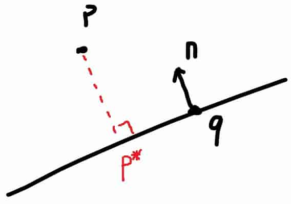
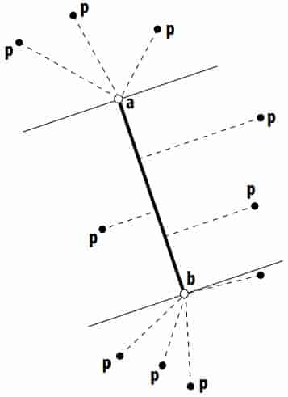
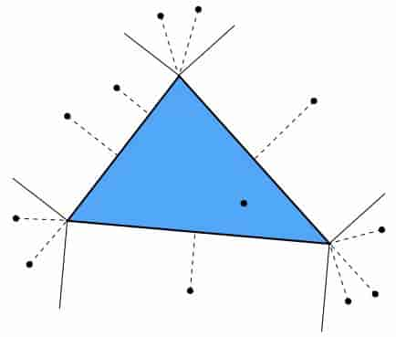
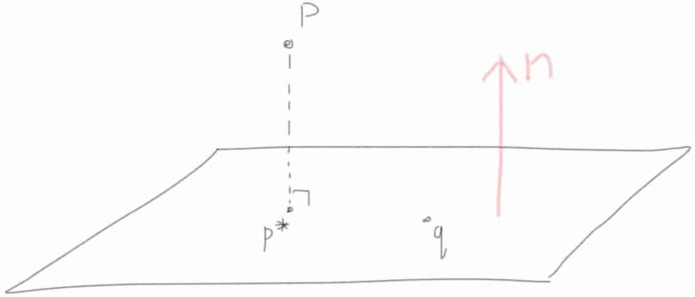
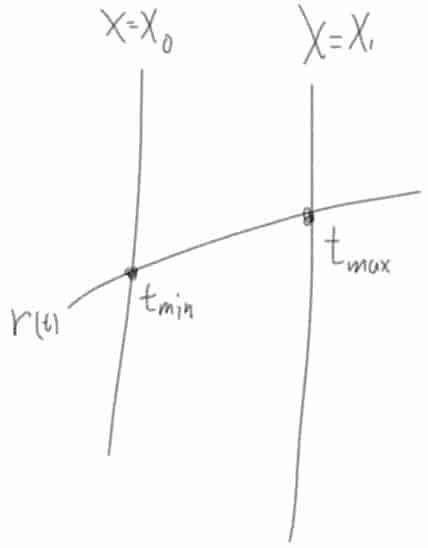

# 12 Geometric Queries 

## 12.1 Closest Point

**distance of two points**

$||\mathbf{p}-\mathbf{q}||$

**distance between a point and a line in 2D**



Point $\mathbf{q}$ is on a line with normal $\mathbf{n}$, so the line is
$$
\mathbf{n}\cdot(\mathbf{x}-\mathbf{q})=0\\
\mathbf{n}\cdot\mathbf{x}=\mathbf{n}\cdot\mathbf{q}=c\\
$$
so the distance is
$$
d=(\mathbf{p}-\mathbf{q})\cdot \mathbf{n}=\mathbf{p}\cdot\mathbf{n}-c
$$
**closest point on line in 2D**

$\mathbf{p}^*=\mathbf{p}+d(-\mathbf{n})=\mathbf{p}+(c-\mathbf{p}\cdot\mathbf{n})\mathbf{n}$

**closest point on line segment in 2D**

- find closest point on line
- check if it’s between endpoints
- if not, take closest endpoint 



**closest point on triangle in 2D**

Almost just minimum distance to three segments 



**Closest point on plane**



similar to case "closest point on line in 2D"

the plane is $\mathbf{n}\cdot(\mathbf{x}-\mathbf{q})=0$, so $\mathbf{n}\cdot \mathbf{x}=\mathbf{n}\cdot \mathbf{q}=c$

the distance of $\mathbf{p}$ and the plane is $d = (\mathbf{p}-\mathbf{q})\cdot\mathbf{n}=\mathbf{p}\cdot\mathbf{n}-c$

so the closest point is $\mathbf{p}^*=\mathbf{p}+d(-\mathbf{n})=\mathbf{p}+(c-\mathbf{p}\cdot\mathbf{n}) \mathbf{n}$

**Closest point on triangle in 3D**

- project onto plane of triangle

  > the closest point on triangle plane)

- use half-space tests to classify point (vs. half plane)

  > or project to plane and use half-plane test

- if inside the triangle, we’re done!

- otherwise, fnd closest point on associated vertex or edge 

**Closest point on triangle mesh**

Conceptually easy

- loop over all triangles
- compute closest point to current triangle
- keep globally closest point 

but cost a lot, need better data structures

**Closest point to implicit surface**

One idea:
- start at the query point

- compute gradient of distance

  > using, e.g., finite differences(有限差分) 

- take a little step (decrease distance)

- repeat until we’re at the surface (zero distance) 

Better yet: just store closest point for each grid cell! (speed/memory trade off) 

## 12.2 Ray Intersection

can express ray as $\mathbf{r}(t)=\mathbf{o}+t\mathbf{d}$

**Ray Sphere Intersection**
$$
||\mathbf{r}(t)-\mathbf{c}||=R\\
\mathbf{r}(t)=\mathbf{o}+t\mathbf{d}\\
(t\mathbf{d}+\mathbf{o}-\mathbf{c})^2=R^2\\
||\mathbf{d}||^2t^2+2\ \mathbf{d}\cdot(\mathbf{o}-\mathbf{c})\ t+||\mathbf{o}-\mathbf{c}||^2-R^2=0
$$
**Ray Plane Intersection**
$$
\mathbf{n}\cdot\mathbf{r}(t)=c\\
\mathbf{n}\cdot(\mathbf{o}+t\mathbf{d})=c\\
t=\frac{c-\mathbf{n}\cdot\mathbf{o}}{\mathbf{n}\cdot\mathbf{d}}
$$
**Ray Triangle Intersection**

- Triangle is in a plane...
- Not much more to say!
  - Compute ray-plane intersection
  - Q: What do we do now?
  - A: Why not compute barycentric coordinates of hit point?
  - If barycentric coordinates are all positive, point in triangle
- Actually, a lot more to say... if you care about performance! 

Parameterize triangle given by vertices using barycentric coordinates 
$$
f(u,v)=(1-u-v)\mathbf{p}_0+u\mathbf{p}_1+v\mathbf{p}_2
$$
Plug parametric ray equation directly into equation for points on triangle: 
$$
\mathbf{p}_0 + u(\mathbf{p}_1 - \mathbf{p}_0) + v(\mathbf{p}_2 - \mathbf{p}_0) = \mathbf{o} + t\mathbf{d}
$$
solve for $\mathbf{u,v,t}$
$$
\begin{bmatrix}
\mathbf{p}_1-\mathbf{p}_0
&\mathbf{p}_2-\mathbf{p}_0
&-\mathbf{d}
\end{bmatrix}
\begin{bmatrix}
u\\v\\t
\end{bmatrix}
=\mathbf{o}-\mathbf{p}_0
$$
**Ray AABB Intersection**

每一个维度都求出一个 $t_{min}$ 和 $t_{max}$



3个维度得到3个区间，公共区间不为空则说明相交

**Ray-scene intersection**

Given a scene defned by a set of N primitives and a ray r, fnd the closest point of intersection of r with the scene 

```c++
Primitive * p_closest = NULL;
float t_closest = inf;
for(auto p : scene){
    float t = p.intersect(r)
    if(t >= 0 && t < t_closest){
        t_closest = t;
        p_closest = p;
    }
}
```

Complexity: O(N) 

## 12.3 Mesh-Mesh Intersection 

**point-point intersection**

check if they’re the same point! 

**point-line intersection**

plug it into the line equation! 

**line-line intersection in 2D**

$a_1 x+b_1 y=c_1,\ a_2 x+b_2 y=c_2$

Leads linear system 

> line-line intersection in 3D
>
> $o_1+t_1d_1=o_2+t_2d_2$
>
> 在 xy 平面算出 $t_1, t_2$，然后代入 z 维检查是否相等

**Triangle-Triangle Intersection**

Lots of ways to do it

Basic idea:

- Q: Any ideas?
- One way: reduce to edge-triangle intersection
- Check if each line passes through plane
- Then do interval test 
