# The Rendering Equation

**The Rendering Equation** 

Core functionality of photorealistic renderer is to estimate radiance at a given point p, in a given direction $\omega_o$

Summed up by the rendering equation (Kajiya): 

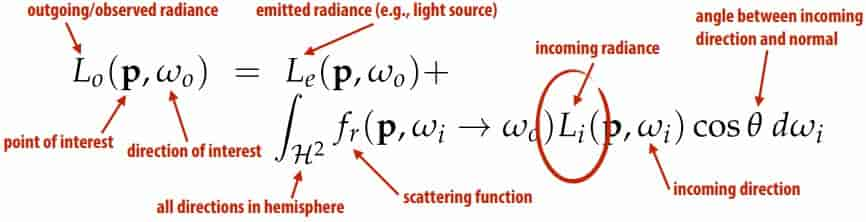

> Rewrite
> $$
> L_o(\mathbf{p},\omega_o)=L_e(\mathbf{p},\omega_o) + \int_{\mathcal{H}^2}f_r(\mathbf{p},\omega_i\to\omega_o)L_i(\mathbf{p},\omega_i)\cos\theta \ \text{d}\omega_i
> $$
>

==Key challenge: to evaluate incoming radiance, we have to compute yet another integral==. I.e., rendering equation is ==recursive==. 

**Recursive Raytracing** 

Basic strategy: recursively evaluate rendering equation! 

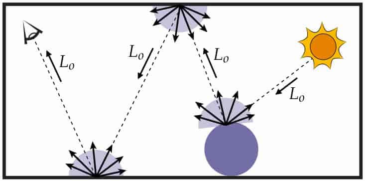

**Refection models**

Refection is the process by which light incident on a surface interacts with the surface such that it leaves on the incident (same) side without change in frequency 

Some basic refection functions 

- Ideal specular

  Perfect mirror 

  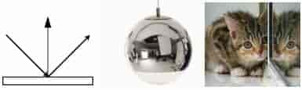

- Ideal diffuse 

  Uniform refection in all directions 

  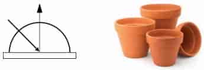

- Glossy specular 

  Majority of light distributed in refection direction 

  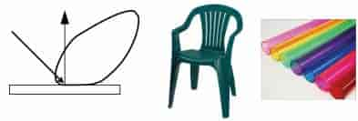

- Retro-refective 

  Refects light back toward source 

  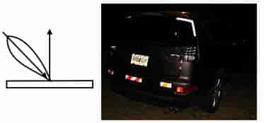

**Models of Scattering**

Many different things that could happen to a photon 

- bounces off surface 
- transmitted through surface 
- bounces around inside surface 
- absorbed & re-emitted 

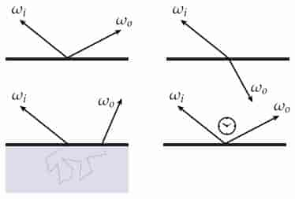

What goes in must come out! (Total energy must be conserved) 

**Hemispherical incident radiance**

At any point on any surface in the scene, there’s an incident radiance field that gives the directional distribution of illumination at the point 

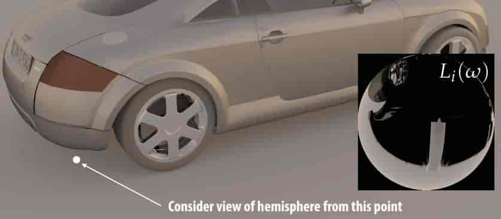

**Diffuse refection**

Exitant radiance is the same in all directions 

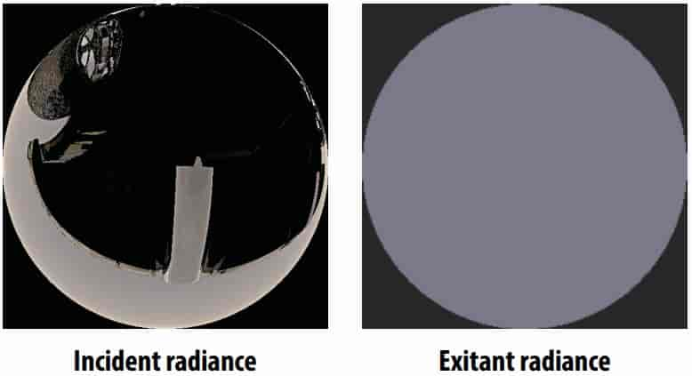

**Ideal specular refection**

Incident radiance is “fipped around normal” to get exitant radiance 

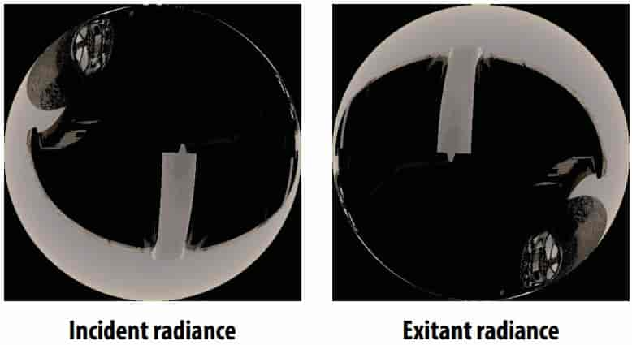

**Plastic**

Incident radiance gets “fipped and blurred” 

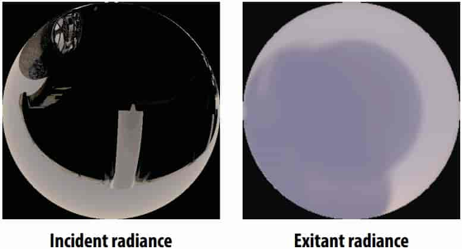

**Copper**

More blurring, plus coloration (nonuniform absorption across frequencies) 

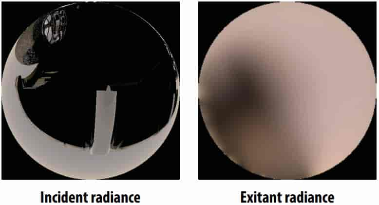

**Scattering off a surface: the BRDF**

> BRDF is “Bidirectional reflectance distribution function” 

- Encodes behavior of light that “bounces off” surface 

  Given incoming direction $\omega_i$, how much light gets scattered in any given outgoing direction $\omega_0$? 

- Describe as distribution $f_r(\omega_i\to\omega_o)$ 

  $$
  f_r(\omega_i\to\omega_o)\ge0\\
  f_r(\omega_i\to\omega_o)=f_r(\omega_o\to\omega_i)\\
  \int_{\mathcal{H}^2}f_r(\omega_i\to\omega_o)\cos\theta\ \text{d}\omega_i\le1
  $$

  >BRDF需要处理表面上半球的各个方向，使用球坐标系定义方向更加方便
  >
  >所以BRDF也可以表示成 $f_r(\theta_i,\phi_i;\theta_o,\phi_o)$
  >
  >---
  >
  >**Cook-Torrance BRDF**
  >$$
  >f_r=k_df_\text{lambert}+k_sf_\text{cook-torrance}\\
  >f_\text{cook-torrance}=\frac{DFG}{4(\omega_0\cdot\mathbf{n})(\omega_i\cdot\mathbf{n})}
  >$$
  >$k_s$ 是 镜面反射 部分，$k_d=1-k_s$ 是 折射/漫反射 部分
  >
  >$f_\text{lambertian}$ 是下边提到的漫反射BRDF
  >
  >$f_\text{cook-torrance}$ 是 镜面反射 BRDF
  >
  >D, F, G 三个函数分别为正态分布函数(Normal**D**istribution Function)，菲涅尔方程(**F**resnel Rquation)和几何函数(**G**eometry Function)
  >
  >- **正态分布函数**：估算在受到表面粗糙度的影响下，取向方向与中间向量一致的微平面的数量。这是用来估算微平面的主要函数。
  >  $$
  >  NDF_{GGXTR}(\mathbf{n},\mathbf{h},\alpha)=\frac{\alpha^2}{\pi((\mathbf{n}\cdot\mathbf{h})^2(\alpha^2-1)+1)^2}
  >  $$
  >  在这里$\mathbf{h}$表示用来与平面上的微平面做比较用的中间向量，而$\alpha$表示表面粗糙度
  >
  >  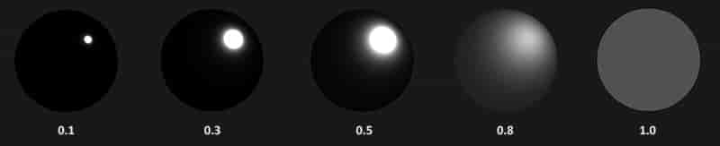
  >
  >- **几何函数**：描述了微平面自成阴影的属性。当一个平面相对比较粗糙的时候，平面表面上的微平面有可能挡住其他的微平面从而减少表面所反射的光线。
  >
  >  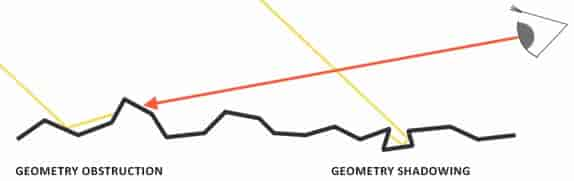
  >  $$
  >  G_{SchlickGGX}(\mathbf{n},\mathbf{v},k)=\frac{\mathbf{n}\cdot\mathbf{v}}{(\mathbf{n}\cdot\mathbf{v}(1-k)+k)}\\
  >  G(\mathbf{n},\mathbf{v},\mathbf{l},k)=G_{sup}(\mathbf{n},\mathbf{v},k)G_{sup}(\mathbf{n},\mathbf{l},k)
  >  $$
  >  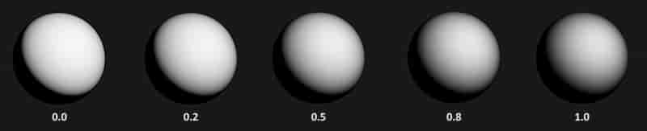
  >
  >- **菲涅尔方程**：菲涅尔方程描述的是在不同的表面角下表面所反射的光线所占的比率。
  >  $$
  >  F_{Schlick}(\mathbf{n},\mathbf{v},F_0)=F_0+(1−F_0)(1−(\mathbf{n}⋅\mathbf{v}))^5
  >  $$
  >  $F_0$ 表示平面的基础反射率，它是利用所谓折射指数(Indices of Refraction)或者说IOR计算得出的
  >  $$
  >  F_0=(\frac{n_t-1}{n_t+1})^2
  >  $$
  >  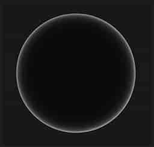

- Radiometric description
  $$
  f_r(\omega_i\to\omega_o)=\frac{\text{d}L_o(\omega_o)}{\text{d}E_i(\omega_o)}
  =\frac{\text{d}L_o(\omega_o)}{L_i(\omega_i)\cos\theta_i\ \text{d}\omega_i}[1/\text{sr}]
  $$

  > $$E(\omega)=\int_{H^2}L(\omega)\cos\theta\ \text{d}\omega$$
  > $$\text{d}E=L\cos\theta\ \text{d}\omega$$

**Example: Lambertian refection BRDF**

Assume light is equally likely to be refected in each output direction
$$
\begin{aligned}
f_r(\mathbf{p})&=\frac{\rho(\mathbf{p})}{\pi}\\
L_o(\mathbf{p},\omega_o)
&=\int_{\mathcal{H}^2}{f_r(\mathbf{p})L_i(\mathbf{p},\omega_i)\cos\theta}\ \text{d}\omega_i\\
&=f_r(\mathbf{p})\int_{\mathcal{H}^2}{L_i(\mathbf{p},\omega_i)\cos\theta}\ \text{d}\omega_i\\
&=f_r(\mathbf{p})E(\mathbf{p})\\
&=\frac{\rho(\mathbf{p})}{\pi}E(\mathbf{p})\\
\end{aligned}
$$

> $\rho(\mathbf{p})$ is albedo, between 0 and 1, because
> $$
> 0\le\int_{\mathcal{H}^2}{f_r(\mathbf{p})\cos\theta}\ \text{d}\omega_i\le 1\\
> 0\le\frac{\rho(\mathbf{p})}{\pi}\int_0^{2\pi}\int_0^\pi\cos\theta\ \le 1\text{d}\phi\text{d}\theta\\
> 0\le\rho(\mathbf{p})\le 1\\
> $$
>

**Example: perfect specular reflection**

- Geometry of specular refection

  - $\theta=\theta_o=\theta_i$

    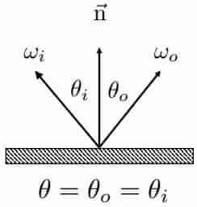

  - $\phi_o=\phi_i$

    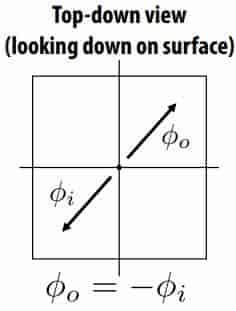

  - $\omega_i=-\omega_i+2(\omega_i\cdot\mathbf{n})\mathbf{n}$

- Specular refection BRDF 
  $$
  L_o(\theta_o,\phi_o)=L_i(\theta_i,\phi_i)\\
  f_r(\theta_i,\phi_i;\theta_o,\phi_o)=\left\{
  \begin{array}{ccl}
  \frac{1}{\cos\theta_i}       &      & {\theta_o=\theta_i \text{ and }\phi_i=\phi_o\pm\pi}\\
  1     &      & \text{otherwise}\\
  \end{array} \right.
  $$
  Strictly speaking, $f_r$ is a distribution, not a function

  In practice, no hope of finding refected direction via random sampling; simply pick the refected direction! 

**Transmission**

In addition to refecting off surface, light may be transmitted through surface. 

Light refracts when it enters a new medium. 

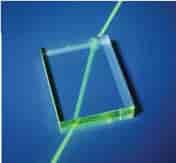

- Snell’s Law

  Transmitted angle depends on relative index of refraction of material ray is leaving/entering. 

  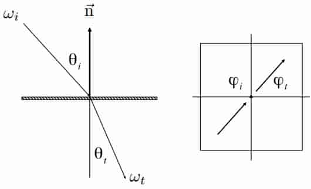

  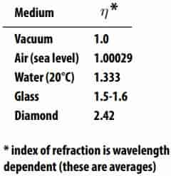
  $$
  \begin{aligned}
  \eta_i\sin\theta_i
  &=\eta_t\sin\theta_t\\
  \cos\theta_t
  &=\sqrt{1-\sin^2\theta_t}\\
  &=\sqrt{1-(\frac{n_i}{n_t})^2\sin^2\theta_i}\\
  &=\sqrt{1-(\frac{n_i}{n_t})^2(1-\cos^2\theta_i)}
  \end{aligned}
  $$

- Total internal refection

  When light is moving from a more optically dense medium to a less optically dense medium

  Light incident on boundary from large enough angle will not exit medium. 
  $$
  1-(\frac{n_i}{n_t})^2(1-\cos^2\theta_i)<0
  $$
  Only small “cone” visible, due to total internal refection (TIR) 

  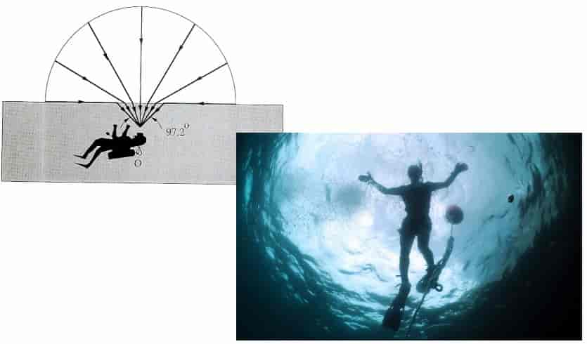

- Fresnel refection

  Many real materials: refectance increases with viewing angle 

  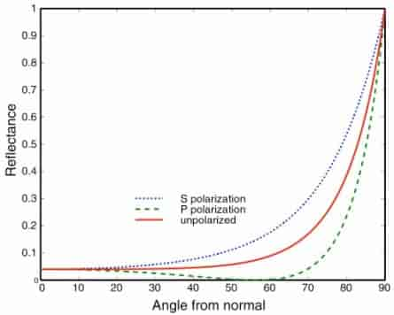

  

**Anisotropic refection**

Refection depends on azimuthal angle(方位角)!


**Translucent materials** 

- Jade

  

- skin

- leaves

  

**Subsurface scattering** 

Visual characteristics of many surfaces caused by light entering at different points than it exits 

Violates a fundamental assumption of the BRDF 

Need to generalize scattering model (BSSRDF) : $S(\mathbf{p}_i,\omega_i,\mathbf{p}_o,\omega_o)$

> BSSRDF is "Bidirectional Scattering Surface Reflectance Distributed Function"

Generalization of refection equation integrates over all points on the surface and all directions(!) 
$$
L_o(\mathbf{p}_o,\omega_o)=
\int_\mathcal{A}
\int_{\mathcal{H}^2}
{S(\mathbf{p}_i,\omega_i,\mathbf{p}_o,\omega_o)L_i(\mathbf{p_i},\omega_i)\cos\theta}
\ \text{d}\omega_i\text{d}A
$$

> BRDF is
> $$
> L_o(\mathbf{p},\omega_o)=L_e(\mathbf{p},\omega_o) + \int_{\mathcal{H}^2}f_r(\mathbf{p},\omega_i\to\omega_o)L_i(\mathbf{p},\omega_i)\cos\theta \ \text{d}\omega_i
> $$
>

**Algorithm to compute render equation** 

Approximate integral via Monte Carlo integration 

Generate directions $\omega_j$ sampled from some distribution $p(\omega)$ 

Compute the estimator 
$$
\frac{1}{N}\sum_{j=1}^N\frac{f_r(\mathbf{p},\omega_j\to\omega_r)L_i(\mathbf{p},\omega_j)\cos\theta_j}{p(\omega_j)}
$$
To reduce variance $p(\omega_j)​$ should match BRDF or incident radiance function 

```c++
// Assume:
// Ray ray hits surface at point hit_p
// Normal of surface at hit point is hit_n

Vector3D wr = -ray.d; // outgoing direction
Spectrum Lr = 0.;
for (int i = 0; i < N; ++i) {
    Vector3D wi; // sample incident light from this direction
    float pdf; // p(wi)
    
    generate_sample(brdf, &wi, &pdf); // generate sample according to brdf
    
    Spectrum f = brdf->f(wr, wi);
    Spectrum Li = trace_ray(Ray(hit_p, wi)); // compute incoming Li
    Lr += f * Li * fabs(dot(wi, hit_n)) / pdf;
}
return Lr / N;
```