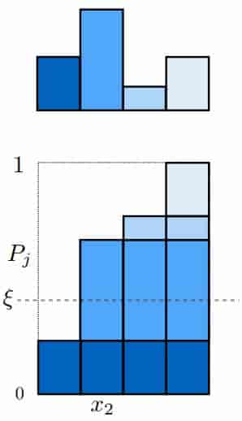
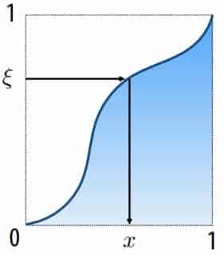
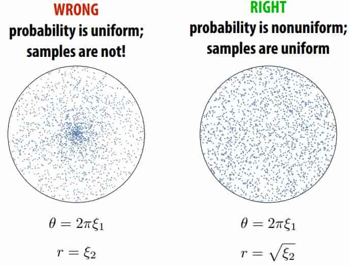
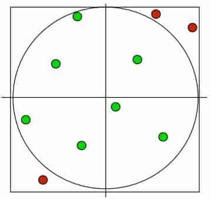
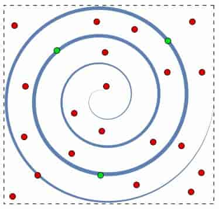

# 17 Numerical Integration 

**Overview**

In graphics, many quantities we’re interested in are naturally expressed as integrals (total brightness, total area, …) 

For very, very simple integrals, we can compute the solution analytically 

For everything else, we have to compute a numerical approximation 

Basic idea:
- integral is “area under curve” or average value times size of domain 
- sample the function at many points
- integral is approximated as weighted sum

**Monte Carlo Integration**

Estimate value of integral using random sampling of function 

Only requires function to be evaluated at random points on its domain 

==Error of estimate is independent of the dimensionality of the integrand, depends on the number of random samples used== 

> **MCI from Wikipedia** 
>
> > https://en.wikipedia.org/wiki/Monte_Carlo_integration
>
> 蒙特卡洛积分问题就是计算多维定积分
> $$
> I=\int_\Omega f(\overline{x})\ \text{d}\overline{x}
> $$
> 其中 $\Omega$ 是 $R^m$ 的子集，有体积
> $$
> V=\int_\Omega \text{d}\overline{x}
> $$
> 最简单的 Monte Carlo 方法是在 Ω 中均匀采样，得到 N 个均匀的样本
> $$
> \overline{x}_1, \overline{x}_2,...,\overline{x}_N\in\Omega
> $$
> $I$ 估计为
> $$
> I\approx Q_N=V\frac{1}{N}\sum_{i=1}^Nf(\overline{x}_i)=V\langle f\rangle
> $$
> 大数定律保证了
> $$
> \lim\limits_{N\to\infty}Q_N=I
> $$
> 考虑 $Q_N$，利用无偏估计可以通过样本方差来估计 $Q_N$ 的误差条(error bar)
> $$
> Var(f)=\sigma^2_N=\frac{1}{N-1}\sum_{i=1}^N(f(\overline x_i)-\langle f\rangle)^2
> $$
> 因此
> $$
> Var(Q_N)=\frac{V^2}{N^2}Var(\sum_{i=1}^Nf(\overline x_i))=\mathbf{V^2}\frac{\sigma^2_N}{N}
> $$
> 只要 $\{\sigma^2_1,\sigma^2_2,...\}$ 是有界的，则方差以$\frac{1}{N}$ 的速度减小，不依赖于积分的维度
>
> 需要注意的是，与确定性方法不同，误差的估计不是严格的误差界限;随机抽样可能无法发现被积函数的所有重要特征，而这些特征可能导致对误差的低估。
>
> 另外可以使用非均匀分布的样本，一般用于重要性采样
>
> > https://en.wikipedia.org/wiki/Importance_sampling
>
> 新的分布，最优就是
> $$
> \frac{f(x)}{I}
> $$
> 此时一个样本就能达到方差为0，因为这种分布本身就包含了我们想求的积分 $I$，因此不会有误差
>
> 但实际上我们要求的就是 I，所以无法直接获取最优的分布

**generate samples of a discrete random variable (with a known PDF)** 

To randomly select an event, select $x_i$ if $P_{i-1}<\xi\le P_i$

$P$ 是累计概率函数 $P_j=\sum_{i=1}^j p_i$

$\xi$ 是均匀分布随机变量 $\in [0,1)$

**Sampling continuous random variables using the inversion method**

Cumulative probability distribution function 
$$
P(x) = Pr(X < x)=\int_{-\infty}^xp(t)\ \text{d}t
$$
Construction of samples: solve for $x=P^{-1}(\xi)$ 

Must know the formula for:
1. The integral of $p(x)$ 
2. The inverse function $P^{-1}(x)$ 

**Uniformly sampling unit circle**

what is uniformly sampling?

it is $p(x_1,x_2,...,x_n)d_{x_1}d_{x_2}...d_{x_n}=dS(x_1,x_2,...,x_n)/Area$

so
$$
p(r,\theta)drd\theta=rdrd\theta/\pi\\
p(r,\theta)=r/\pi\\
p(r)p(\theta)=r/\pi\\
p(\theta)=c,p(r)=r/(c\pi)\\
P(\theta)=c\theta,P(2\pi)=2\pi c=1,c=\frac{1}{2\pi},\theta=2\pi\xi_1\\
p(r)=2r,P(r)=r^2,r=\sqrt{\xi_2}\\
$$

**Uniform sampling via rejection sampling**

Completely different idea: pick uniform samples in square (easy)
Then toss out any samples not in square (easy) 

If the region we care about covers only a very small fraction of the region we’re sampling, rejection is probably a bad idea: 

