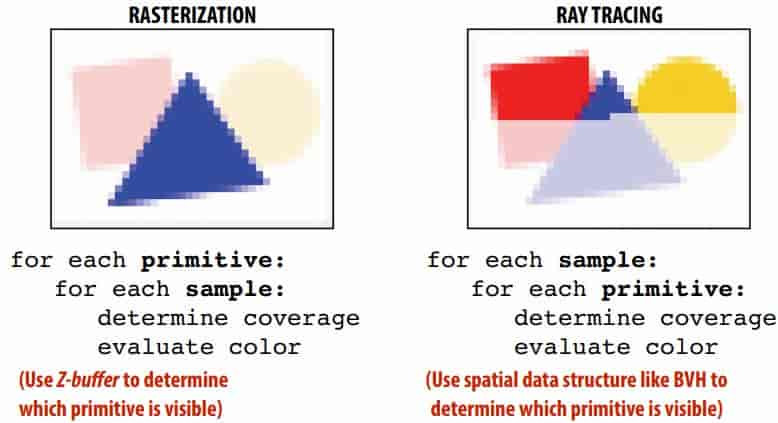
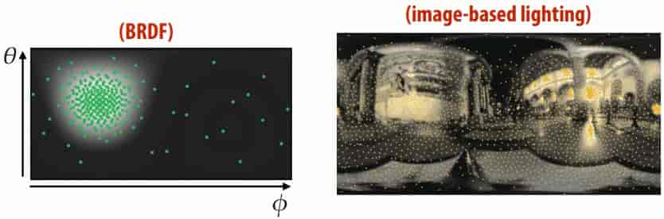
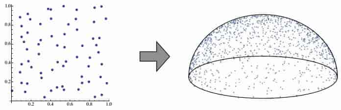
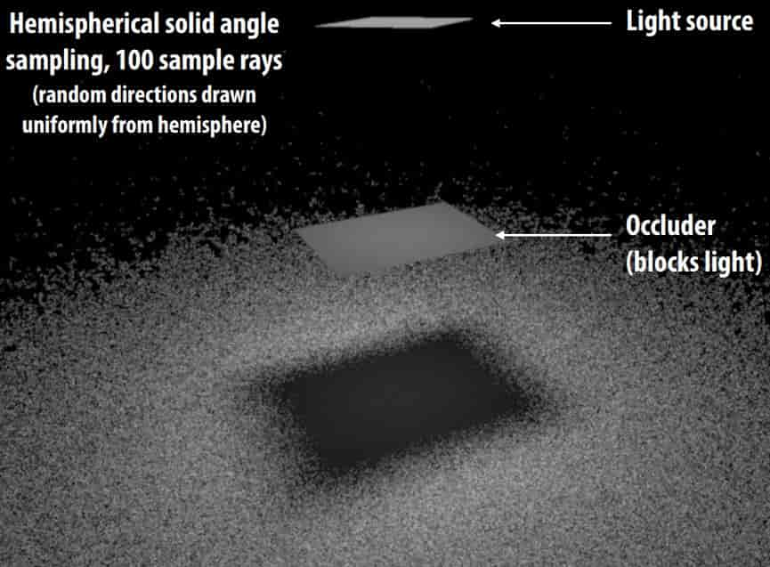
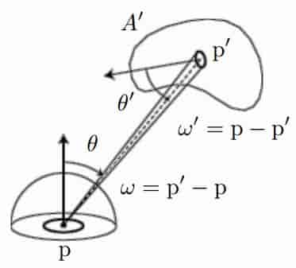
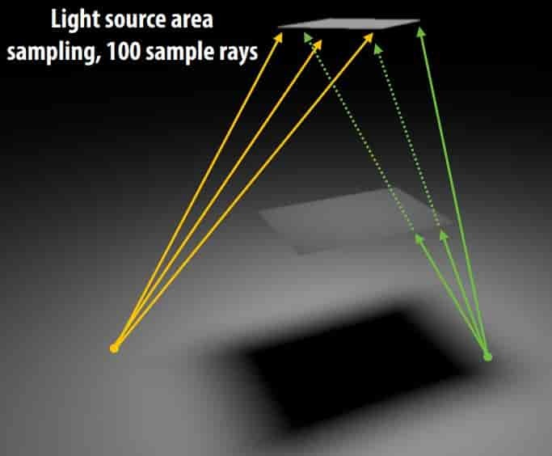
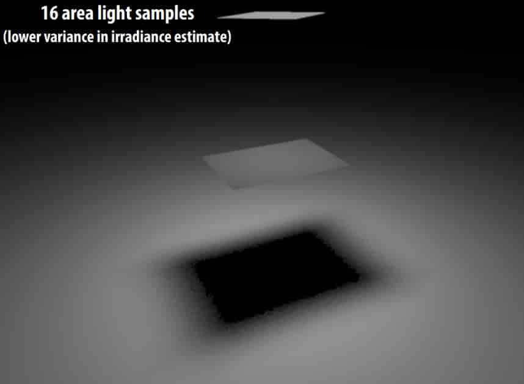
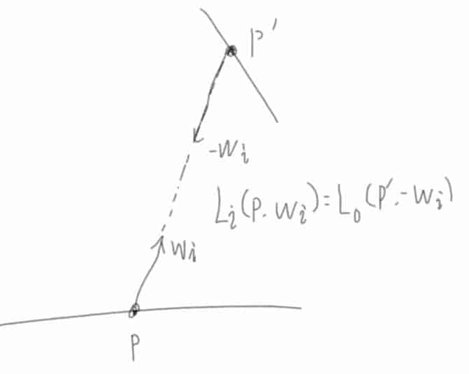
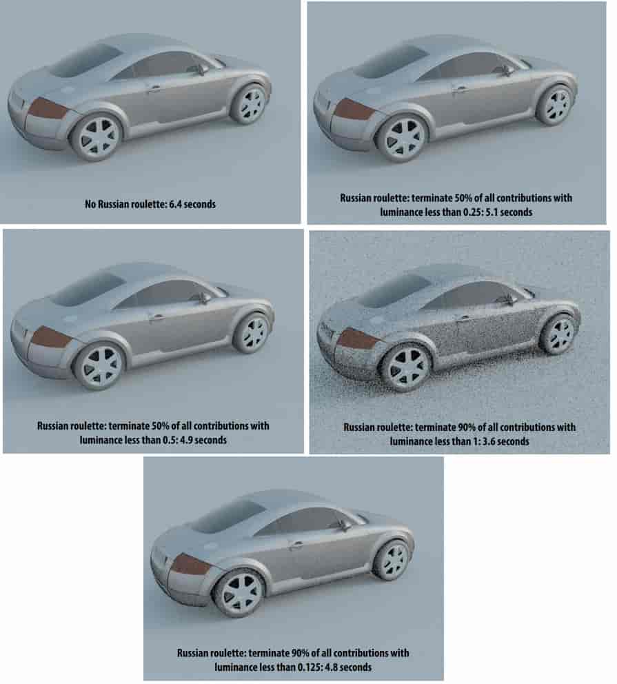

# 18 Monte Carlo Ray Tracing

**Ray Tracing vs. Rasterization** 

- Order

  

- illumination

  - [LOCAL] rasterizer processes one primitive at a time; hard* to determine things like “A is in the shadow of B”

    > \*But ==not impossible== to do ==some== things with rasterization (e.g., shadow maps)… just results in more complexity 

  - [GLOBAL] ray tracer processes on ray at a time; ray knows about everything it intersects, easy to talk about shadows & other “global” illumination effects 

**Importance Sampling in RTX** 

put more where integrand is large (“most useful samples”) 

**Direct lighting—uniform sampling** 

Uniformly-sample hemisphere of directions with respect to solid angle 
$$
p(\omega)=\frac{1}{2\pi}\\
E(\mathbf{p})=\int_{\mathcal{H}^2}L(\mathbf{p},\omega)\cos\theta\ \text{d}\omega\\
X_i \sim p(\omega)\\
Y_i=f(X_i)\\
Y_i=L(\mathbf{p},\omega_i)\cos\theta_i\\
F_N=\frac{2\pi}{N}\sum_{i=1}^N Y_i\\
$$

> Aside: Picking points on unit hemisphere 
>
> $(\xi_1, \xi_2) = (\sqrt{1-\xi_1^2}\cos(2\pi\xi_2), \sqrt{1-\xi_1^2}\sin(2\pi\xi_2), \xi_1)$ 
>
> 
>
>  推导如下：
> $$
> \begin{aligned}
> p(\theta,\phi)\ \text{d}\theta\text{d}\phi&=\frac{\sin\theta\ \text{d}\theta\text{d}\phi}{2\pi}\\
> p(\theta)p(\phi)&=\frac{\sin\theta}{2\pi}\\
> \end{aligned}\\
> \begin{aligned}
> &p(\phi)=\frac{1}{2\pi},&&P(\phi)=\frac{\phi}{2\pi},&&\phi=2\pi\xi_2\\
> &p(\theta)=\sin\theta,&&P(\theta)=1-\cos\theta,&&\cos\theta=1-\xi_1\leftrightarrow\xi_1\\
> \end{aligned}\\
> \begin{aligned}
> (x,y,z)
> &=(\sin\theta\cos\phi,\sin\theta\sin\phi,\cos\theta)\\
> &=(\sqrt{1-\xi_1^2}\cos(2\pi\xi_2), \sqrt{1-\xi_1^2}\sin(2\pi\xi_2), \xi_1)
> \end{aligned}\\
> $$
>

**Cosine-Weighted Hemisphere Sampling** 
$$
\begin{aligned}
\int_{\mathcal{H}^2}\cos\theta\sin\theta\ \text{d}\omega &=\pi\\
p(\theta,\phi)\ \text{d}\theta\text{d}\phi&=\frac{\cos\theta\sin\theta\ \text{d}\theta\text{d}\phi}{\pi}\\
p(\theta)p(\phi)&=\frac{\sin2\theta}{2\pi}\\
\end{aligned}\\
\begin{aligned}
&p(\phi)=\frac{1}{2\pi},&&P(\phi)=\frac{\phi}{2\pi},&&\phi=2\pi\xi_2\\
&p(\theta)=\sin2\theta,&&P(\theta)=\frac{1}{2}-\frac{1}{2}\cos2\theta,&&\cos\theta=\sqrt{\xi_1}
\end{aligned}\\
\begin{aligned}
(x,y,z)
&=(\sin\theta\cos\phi,\sin\theta\sin\phi,\cos\theta)\\
&=(\sqrt{1-\xi_1^4}\cos(2\pi\xi_2), \sqrt{1-\xi_1^4}\sin(2\pi\xi_2), \sqrt{\xi_1})
\end{aligned}\\
$$
**Direct lighting—uniform sampling (algorithm)** 

- Given surface point $\mathbf{p}​$ 

- For each of N samples:

  - Generate random direction: $\omega_i$ 

  - Compute incoming radiance $L_i$ arriving at $\mathbf{p}$ from direction: $\omega_i$ 

    > A ray tracer evaluates radiance along a ray 

  - Compute incident irradiance due to ray: $dE_i=L_i\cos\theta_i$ 

  - Accumulate $\frac{2\pi}{N}\ \text{d}E_i$ into estimator

Incident lighting estimator uses different random directions in each pixel. Some of those directions point towards the light, others do not. 

**Reduce noise** 

- Don’t need to integrate over entire hemisphere of directions (incoming radiance is 0 from most directions).
- Just integrate over the area of the light (directions where incoming radiance is non-zero)and weight appropriately 

**Direct lighting: area integral** 

Previously: just integrate over all directions 
$$
E(\mathbf{p})=\int_{\mathcal{H}^2} L_i(\mathbf{p},\omega_i)\cos\theta\ \text{d}\omega_i
$$
Change of variables to integrate over area of light 

$$
d\omega=\frac{\text{d}A}{|\mathbf{p}'-\mathbf{p}|^2}=\frac{\cos\theta'\ \text{d}A'}{|\mathbf{p}'-\mathbf{p}|^2}\\
E(\mathbf{p})=\int_{A'}L_o(\mathbf{p}',\omega')V(\mathbf{p},\mathbf{p}')\frac{\cos\theta\cos\theta'}{|\mathbf{p}-\mathbf{p}'|^2}\ \text{d} A'
$$
$V(\mathbf{p},\mathbf{p}')$ is Binary visibility function: 1 if p’ is visible from p, 0 otherwise (accounts for light occlusion) 
$$
p(\mathbf{p}')=\frac{1}{A'}\\
Y_i=L_o(\mathbf{p}'_i,\omega'_i)V(\mathbf{p},\mathbf{p}'_i)\frac{\cos\theta\cos\theta'}{|\mathbf{p}-\mathbf{p}'|^2}\\
F_N=\frac{A'}{N}\sum_{i=1}^N Y_i
$$

If no occlusion is present, all directions chosen in computing estimate “hit” the light source.
(Choice of direction only matters if portion of light is occluded from surface point p, 即半影区域) 

**Comparing different techniques** 

Variance in an estimator manifests as noise in rendered images 
$$
Efficiency\propto\frac{1}{Variance\times Cost}
$$
**Path tracing: indirect illumination** 
$$
E(\mathbf{p},\omega_o)=\int_{\mathcal{H}^2}f_r(\mathbf{\omega_i},\omega_o)L_{o,i}(tr(\mathbf{p},w_i),-\omega_i)\cos\theta_i\ \text{d}\omega_i
$$
Recursively call path tracing function to compute incident indirect radiance 

**Stop--Russian roulette(轮盘)** 

Idea: want to avoid spending time evaluating function for samples that make a ==small contribution== to the final result 
$$
L=[\frac{f_r(\omega_i\to\omega_o)L_i(\omega_i)\cos\theta_i}{p(\omega_i)}]V(\mathbf{p},\mathbf{p}')
$$
If tentative contribution (in brackets) is small, total contribution to the image will be small regardless of $V(\mathbf{p},\mathbf{p}’)$ 

Ignoring low-contribution samples introduces systematic error 

> No longer converges to correct value! 

Instead, ==randomly discard low-contribution samples== in a way that leaves estimator unbiased 

> New estimator: evaluate original estimator with probability 
$p_{rr}$, reweight. Otherwise ignore

>
> Same expected value as original estimator: 
>$$
> p_{rr}E[\frac{X}{p_{rr}}]+E[(1-p_{rr})0]=E[X]
>$$
>

