# 19 Variance Reduction 

## 19.1 Sampling Strategies 

**Naïve Path Tracing**

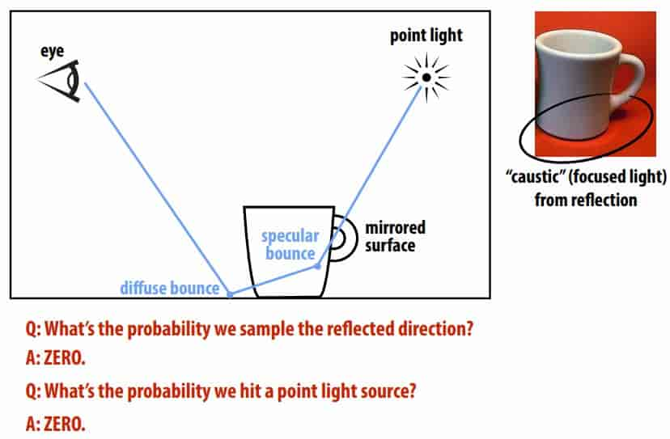

Naïve path tracing misses important phenomena! 

**Importance Sampling in Rendering** 

以下是我们要求的积分公式
$$
L_o(\mathbf{p},\omega_o)=L_e(\mathbf{p},\omega_o) + \int_{\mathcal{H}^2}f_r(\mathbf{p},\omega_i\to\omega_o)L_i(\mathbf{p},\omega_i)\cos\theta \ \text{d}\omega_i
$$
考虑重要性采样，那么 $p(x)$ 应该接近 $f_r(\mathbf{p},\omega_i\to\omega_o)L_i(\mathbf{p},\omega_i)\cos\theta$，但我们并不知道这个函数的具体表达式，只能通过启发性的形式去寻找。

分别考虑乘积项

- $f_r(\mathbf{p},\omega_i\to\omega_o)$：我们可以根据BRDF来确定采样规律，如遇到镜面就往镜面反射方向采样
- $L_i(\mathbf{p},\omega_i)$：我们可以根据光源来确定采样规律，如在光源方向采样

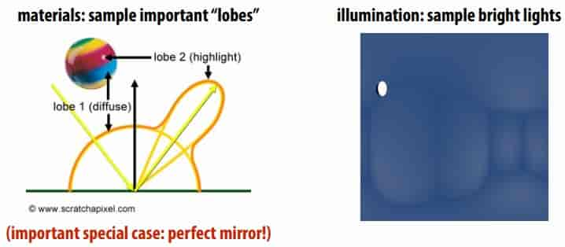

**Bidirectional Path Tracing** 

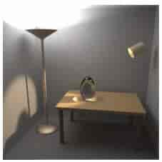

之前提到可以根据光源方向来采样，这是直接光照。但要求与光源之间无阻隔。

考虑上边这个场景，场景中大部分位置与光源之间都存在阻隔，故简单的在光源方向采样也无济于事。

因此考虑双向路径追踪。

Forward path tracing: no control over path length (hits light after n bounces, or gets terminated by Russian Roulette) 

Idea: connect paths from light, eye (“bidirectional”) 

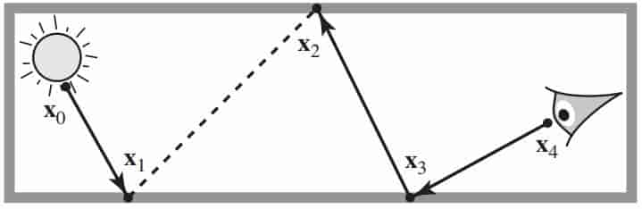

**Metropolis-Hastings Algorithm**

之前提到了双向路径追踪算法，但问题是如何选择光源出发的路径。有时候，光源的大部分路径都是无效的。

Good paths can be hard to find

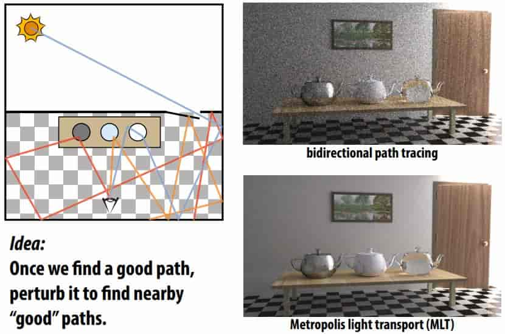

> perturb 扰乱

 Standard Monte Carlo: sum up independent samples 

MH: take random walk of dependent samples (“mutations”) 

Basic idea: prefer to take steps that increase sample value 

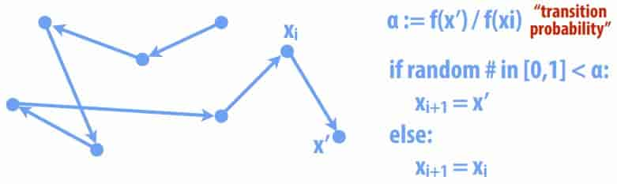

If careful, sample distribution will be proportional to integrand 

- make sure mutations are “ergodic”  
- need to take a long walk, so initial point doesn’t matter (“mixing”) 

> 关于Metropolis-Hastings Algorithm的更详细内容，可以参考 [wikipedia_MHA](https://en.wikipedia.org/wiki/Metropolis%E2%80%93Hastings_algorithm) 

**Metropolis-Hastings: Sampling an Image**

- Want to take samples proportional to image density f
- Start at random point; take steps in (normal) random direction
- Occasionally jump to random point (ergodicity)
- Transition probability is “relative darkness” f(x’)/f(xi) 

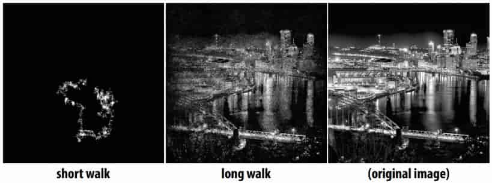

**Metropolis Light Transport** 

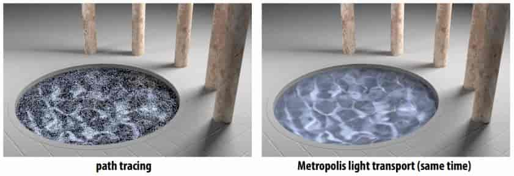

**Multiple Importance Sampling (MIS)**

Many possible importance sampling strategies 

Which one should we use for a given integrand? 

MIS: combine strategies to preserve strengths of all of them 

Balance heuristic is (provably!) about as good as anything

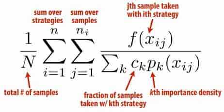

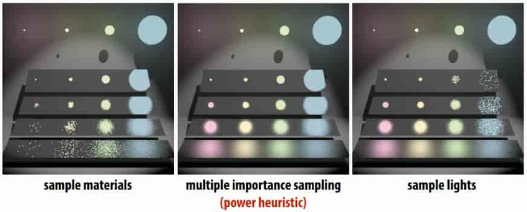

## 19.2 Sampling Patterns

**Sampling Patterns & Variance Reduction**

Want to pick samples according to a given density

But even for uniform density, lots of possible sampling patterns

Sampling pattern will affect variance (of estimator!) 

**Stratifed Sampling**

stratifed estimate never has larger variance (often lower) 

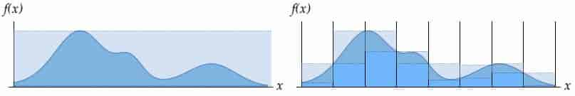

**Low-Discrepancy(差异) Sampling**

“No clumps(块)” hints at one possible criterion for a good sample 

Number of samples should be proportional to area

Discrepancy measures deviation(偏差) from this ideal 

**Quasi-Monte Carlo methods (QMC)**

Replace truly random samples with low-discrepancy samples 

Why? Koksma’s theorem: 

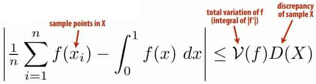

**Hammersley & Halton Points**

Can easy generate samples with near-optimal discrepancy 

First defne radical inverse  $\varphi_r(i)$ 

Express integer i in base r, then refect digits around decimal 

> φ10(1234) = 0.4321 

Can get n Halton points $x_1, …, x_n$ in k-dimensions via 
$$
x_i=(\phi_{P_1}(i),\phi_{P_2}(i),...,\phi_{P_k}(i))
$$
Similarly, Hammersley sequence is 
$$
x_i=(i/n,\phi_{P_1}(i),\phi_{P_2}(i),...,\phi_{P_{k-1}}(i))
$$

> n must be known ahead of time! 

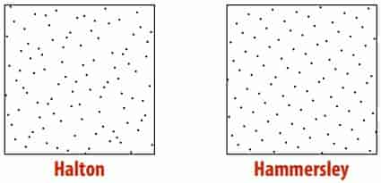

**Adaptive Blue Noise**

Can adjust cell size to sample a given density (e.g., importance) 

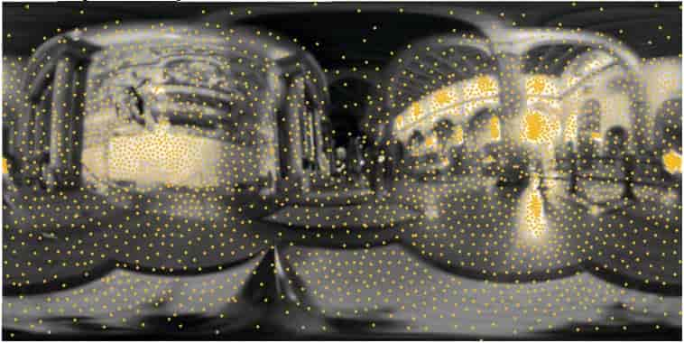

## 19.3 efficiently sample from a large distribution 

**Sampling from the CDF** 

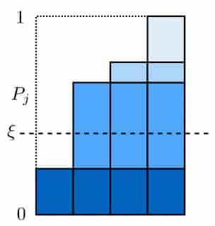

cost is $O(n\log n)$

> 不理解
>
> 用二分查找法的话只需$O(\log n)$
>
> 建表只需$O(n)$

**Alias Table**

Get amortized O(1) sampling by building “alias table” 

Basic idea: rob from the rich, give to the poor (O(n)): 

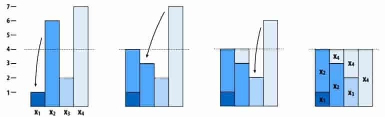

Table just stores two identities & ratio of heights per column 

To sample: 

- pick uniform # between 1 and n
- biased coin fip to pick one of the two identities in nth column 

## 19.4 Other techniques

- Photon Mapping 
- Finite Element Radiosity 
- ...