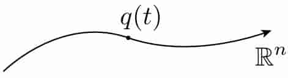
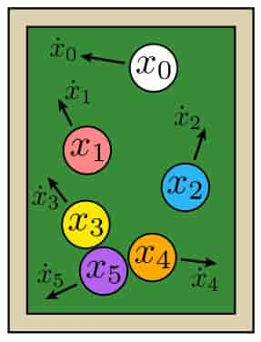
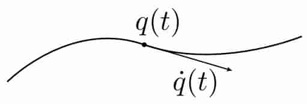
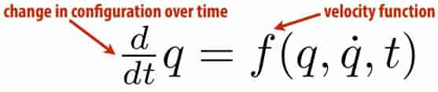

# 21 Dynamics and Time Integration 

**The Animation Equation**

equations 

> ~~F=ma~~

- Any system has a configuration $q(t)$ 
- It also has a velocity $\overset{\mathbf{.}}{q}=\frac{d}{dt}q$ 
- And some kind of mass M
- There are probably some forces F
- Newton’s 2nd law  $\overset{\mathbf{..}}{q}=F/M$
- And also some constraints $g(q,\overset{\mathbf{.}}{q},t)=0$

Makes two things clear:
- acceleration is 2nd time derivative of confguration
- ultimately, we want to solve for the confguration q 

**Generalized(广义) Coordinates**

Often describing systems with many, many moving pieces 

E.g., a collection of billiard balls, each with position $x_i$ 

Collect them all into a single vector of generalized coordinates: 
$$
q=(x_0,x_1,...,x_n)
$$
Can think of q as a single point moving along a trajectory(轨道) in $R^n$

This way of thinking naturally maps to the way we actually solve equations on a computer: all variables are often “stacked” into a big long vector and handed to a solver. 

**Generalized Velocity**

Not much more to say about generalized velocity: it’s the time derivative of the generalized coordinates! 
$$
\overset{\mathbf{.}}{q}=(\overset{\mathbf{.}}{x}_0,\overset{\mathbf{.}}{x}_1,...\overset{\mathbf{.}}{x}_n)
$$

**Ordinary Differential Equations(常微分方程)**

Many dynamical systems can be described via an ordinary differential equation (ODE) in generalized coordinates 

“Ordinary” means “involves derivatives in time but not space” 

> spatial derivatives (PDEs)  

Newton’s 2nd law
$$
\overset{\mathbf{..}}{q}=F/M
$$
“Second order” ODE since we take two time derivatives 

Can also write as a system of two frst order ODEs, by introducing new “dummy” variable for velocity: 
$$
\overset{\mathbf{.}}{q}=v\\
\overset{\mathbf{.}}{v}=F/m
$$
**Lagrangian Mechanics** 

kinetic energy 

1. Write down kinetic energy K

2. Write down potential energy U

3. Write down Lagrangian $\mathcal{L}:=K-U$ 

4. Dynamics(动力学方程) then given by Euler-Lagrange equation

$$
\frac{d}{dt}\frac{\partial\mathcal{L}}{\partial\overset{\mathbf{.}}{q}}=\frac{\partial\mathcal{L}}{\partial q}
$$

Why is this useful?
- often easier to come up with (scalar) energies than forces
- very general, works in any kind of generalized coordinates
- helps develop nice class of numerical integrators (symplectic(偶对的)) 

Example: Pendulum

- $q=\theta$

- Kinetic energy

  $K=\frac{1}{2}I\omega^2=\frac{1}{2}mL^2\overset{\mathbf{.}}{\theta}$

- Potential energy

  $U=mgh=-mgL\cos\theta$

- Euler-Lagrange equations 
  $$
  \mathcal{L}=K-U=m(\frac{1}{2}L^2\overset{\mathbf{.}}{\theta}+gL\cos\theta)\\
  \frac{\partial\mathcal{L}}{\partial\overset{\mathbf{.}}{q}}
  =\frac{\partial\mathcal{L}}{\partial\overset{\mathbf{.}}{\theta}}
  =mL^2\overset{\mathbf{.}}{\theta}\\
  \frac{\partial\mathcal{L}}{\partial q}
  =\frac{\partial\mathcal{L}}{\partial\theta}
  =-mgL\sin\theta\\
  \frac{d}{dt}\frac{\partial\mathcal{L}}{\partial\overset{\mathbf{.}}{q}}=\frac{\partial\mathcal{L}}{\partial q}\Rightarrow
  \overset{\mathbf{..}}{\theta}=-\frac{g}{L}\sin\theta
  $$

- For small angles (e.g., clock pendulum) can approximate as 	

$$
\theta(t)=acos(t\sqrt{g/L}+b)
$$

​	In general, there is no closed form solution!

​	Hence, we must use a numerical approximation 

**Numerical Integration**
$$
\frac{d}{dt}q(t)=f(q(t))
$$
Key idea: replace derivatives with differences 

In ODE, only need to worry about derivative in time 

**Forward Euler**
$$
q_{k+1}=q_k+\tau f(q_k)
$$
Very intuitive: walk a tiny bit in the direction of the velocity

Unfortunately, not very stable—consider pendulum 

**Backward Euler**
$$
q_{k+1}=q_k+\tau f(q_{k+1})
$$
Much harder to solve, since in general f can be very nonlinear! 

**Symplectic Euler**

Nice alternative is symplectic Euler
- update velocity using current confguration
- update confguration using new velocity 

**Numerical Differentiation**
$$
f'(x_0)\Rightarrow\frac{f(x_0+h)-f(x_0)}{h}
$$
**Automatic Differentiation**

Completely different idea: do arithmetic simultaneously on a function and its derivative. 

Use chain rule to determine rules for manipulating tuples 

Example function:$f(x)=ax^2$ 

- Suppose we want the value and derivative at x=2 
- Start with the tuple $(x,\frac{\part}{\part x}x)|_{x=2}=(2,1)$ 
- How do we multiply tuples? $(u,u')\ast(v,v')=(uv,uv'+vu')$ 
- So, squaring our tuple yields $(2,1)\ast(2,1)=(4,4)$ 
- And multiplying by a scales the value and derivative: $(4a, 4a)$

Pros: good accuracy, reasonably fast

Cons: have to redefne all our arithmetic operators! 

**Symbolic Differentiation**

Build explicit tree representing expression 

Apply transformations to obtain derivative 

Pros: only needs to happen once!

Cons: serious development investment 

Current systems not great with vectors, 3D

Often produce unnecessarily complex formula... 