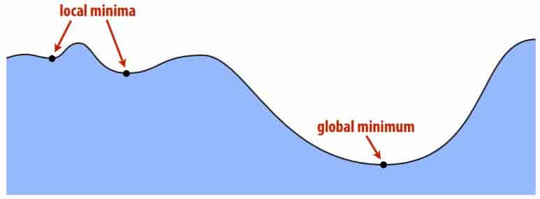
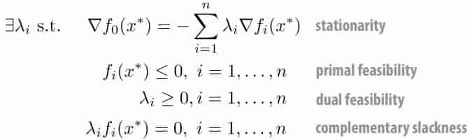
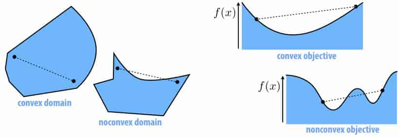
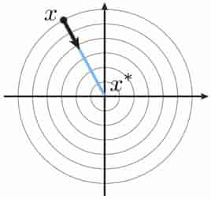
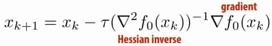
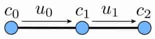
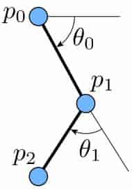

# 22 Intoduction to Optimization 

**Optimization Problem in Standard Form**
$$
\min_{x\in \mathbb{R}^n}\ f_0(\mathbf{x})\\
\text{subject to}\ f_i(\mathbf{x})\le b_i,i=1,...,m
$$
Optimal solution $\mathbf{x}^*​$ has smallest value of $f_0​$ among all feasible $\mathbf{x}​$  

> Q: What if we want to maximize something instead?
> A: Just fip the sign of the objective!
> Q: What if we want equality constraints, rather than inequalities?
> A: Include two constraints: g(x) ≤ c and g(x) ≤ -c 

**Local vs. Global Minima**

Global minimum is absolute best among all possibilities 

Local minimum is best “among immediate neighbors” 

**Characterization of Local Minima**

in R

- $f'_0(x^*)=0$ 
- $f''_0(x^*)\ge0$ 

in $R^n$ 
$$
\nabla f:=
\begin{bmatrix}
\part f/\part x_1\\
...\\
\part f/\part x_n\\
\end{bmatrix}
=0\\
\nabla^2f:
=\begin{bmatrix}
\frac{\part^2 f}{\part x_1^2} & ... & \frac{\part^2 f}{\part x_1\part x_n} \\
... & ... & ...\\
\frac{\part^2 f}{\part x_n\part x_1} & ... & \frac{\part^2 f}{\part x_n^2} \\
\end{bmatrix}
\succeq0\\
$$

> $A\succeq0\Leftrightarrow \forall \mathbf{u},\mathbf{u}^\text{T}A\mathbf{u}\ge 0$

In general, any (local or global) minimizer must at least satisfy the Karush–Kuhn–Tucker (KKT) conditions: 

> 

**Convex Optimization**

Special class of problems that are almost always “easy” to solve (polynomial-time!) 

Problem convex if it has a convex domain and convex objective 

Why care about convex problems in graphics?
- can make guarantees about solution (always the best)
- doesn’t depend on initialization (strong convexity)
- often quite efficient, but not always 

**Gradient Descent Algorithm (nD)**

gradient descent equation 
$$
\frac{d}{dt}x(t)=-\nabla f_0(x(t))
$$
the corresponding discrete update 
$$
x_{k+1}=x_k-\tau\nabla f_0(x_k)
$$
Basic challenge in nD:
- solution can “oscillate”
- takes many, many small steps
- very slow to converge 

**Higher Order Descent**

General idea: apply a coordinate transformation so that the local energy landscape looks more like a “round bowl” 

Gradient now points directly toward nearby minimizer 

Most basic strategy: Newton’s method: 

Great for convex problems (even proofs about # of steps!)

For nonconvex problems, need to be more careful

In general, nonconvex optimization is a BLACK ART 

Meta-strategy: try lots of solvers, see what works! 

> quasi-Newton, trust region, L-BFGS, ... 

**Simple Kinematic Chain**

Consider a simple path-like chain in 2D 

$$
p_1=p_0+e^{i\theta_0}u_0\\
p_2=p_1+e^{i\theta_1}u_1\\
...\\
p_n=p_{n-1}+e^{i\theta_{n-1}}u_{n-1}\\
$$
**Simple IK Algorithm**

Basic idea behind our IK algorithm:
- write down distance between fnal point and “target”
- compute gradient with respect to angles
- apply gradient descent 

Objective 
$$
f_0(\theta)=\frac{1}{2}|\widetilde p_n-p_n|^2
$$
Constraints 

- None! The joint angle can take any value.
- Though we could limit joint angles