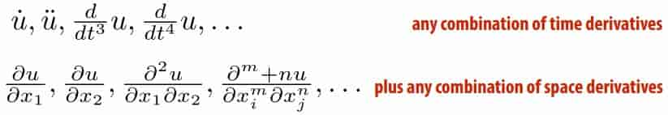
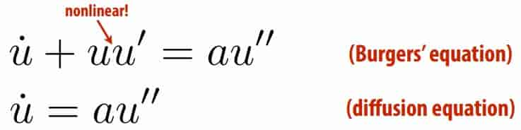
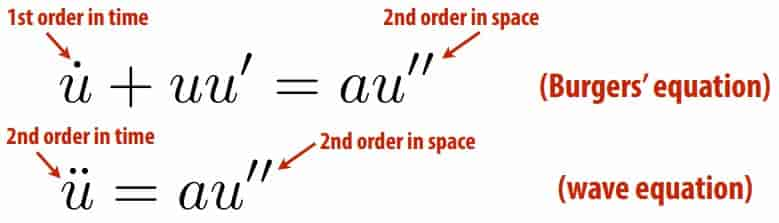
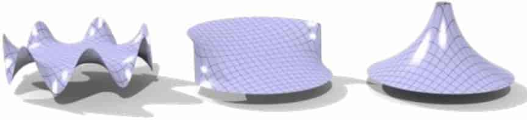
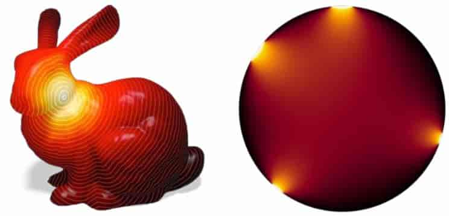
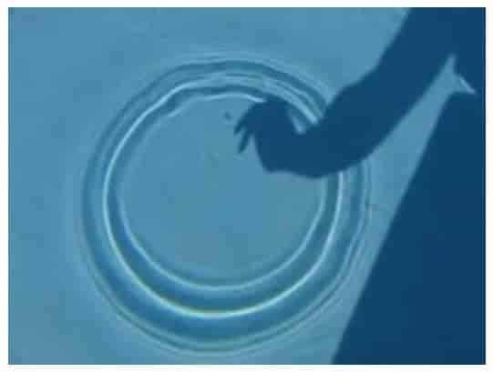
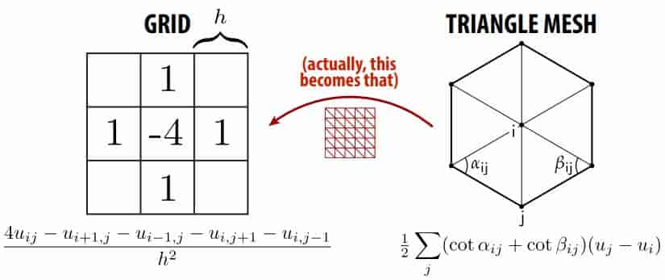

# 23 Physically-Based Animation and PDEs 

## 23.1 Intro

**Partial Diferential Equations (PDEs)** 

ODE: Implicitly describe function in terms of its ==time== derivatives 

PDE: Also include ==space== derivatives in description 

**Definition of a PDE** 

Want to solve for a function of time and space 
$$
u(t,x)
$$
Function given implicitly in terms of derivatives: 

> Example [Burgers' equation] : $\overset{\mathbf{.}}{u}+uu'=au''$ 

**Anatomy of a PDE** 

- Linear vs. nonlinear

  > how are derivatives combined? 

  

- Order

  > how many derivatives in space & time? 

  

- Nonlinear / higher order⇒HARDER TO SOLVE! 

**Model Equations** 

Fundamental behavior of many important PDEs is wellcaptured by three model linear equations: 

- LAPLACE EQUATION (“ELLIPTIC”) 

  > what’s the smoothest function interpolating the given boundary data 

  $$
  \Delta u=0
  $$

- HEAT EQUATION (“PARABOLIC”) 

  > how does an initial distribution of heat spread out over time? 

  $$
  \overset{\mathbf{.}}{u}=\Delta u
  $$

- WAVE EQUATION (“HYPERBOLIC”) 

  > if you throw a rock into a pond, how does the wavefront evolve over time? 

  $$
  \overset{\mathbf{..}}{u}=\Delta u
  $$

**Elliptic PDEs / Laplace Equation** 

> What’s the smoothest function interpolating the given boundary data ?

Conceptually: each value is at the average of its “neighbors” 

Roughly speaking, why is it easier to solve?

Very robust to errors: just keep averaging with neighbors! 

**Parabolic PDEs / Heat Equation** 

> How does an initial distribution of heat spread out over 

After a long time, solution is same as Laplace equation! 

**Hyperbolic PDEs / Wave Equation** 

> If you throw a rock into a pond, how does the wavefront evolve over time? 

Errors made at the beginning will persist for a long time! (hard) 

## 23.2 Compute

**Numerical Solution of PDEs** 

Like ODEs, many interesting PDEs are difcult/impossible to solve analytically—especially if we want to incorporate(混合) data (e.g., user interaction) 

Must instead use numerical integration 

Basic strategy 

- pick a time discretization (forward Euler, backward Euler...) 
- pick a spatial discretization (TODAY) 
- as with ODEs, run a time-stepping algorithm 

**Lagrangian vs. Eulerian** 

Two basic ways to discretize space: Lagrangian & Eulerian 

E.g., suppose we want to encode the motion of a fluid 

- Lagrangian 
  - conceptually easy (like polygon soup!)
  - resolution/domain not limited by grid
  - good particle distribution can be tough
  - finding neighbors can be expensive 

- Eulerian 
  - fast, regular computation
  - easy to represent, e.g., smooth surfaces
  - simulation “trapped” in grid
  - grid causes “numerical difusion” (blur)
  - need to understand PDEs (but you will!) 

- Mixing Lagrangian & Eulerian 

  Of course, no reason you have to choose just one! 

  Many modern methods mix Lagrangian & Eulerian

**Numerical PDEs—Basic Strategy** 

- Pick PDE formulation 
- Pick spatial discretization 
- Pick time discretization 
- Finally, we have an update rule 
- Repeatedly solve to generate an animation 

**The Laplace Operator** 

All of our model equations used the Laplace operator 

Different conventions for symbol: $\Delta,\nabla^2=\nabla\cdot\nabla$ 

Diferential operator: eats a function, spits out its “2nd derivative” 

**Discretizing the Laplacian** 

**Boundary Conditions for Discrete Laplace** 

Two basic boundary conditions 

- Dirichlet—boundary data always set to fxed values 
- Neumann—specify derivative (diference) across boundary 

**Solving the Heat Equation** 
$$
\overset{\mathbf{.}}{u}=\Delta u
$$
forward Euler: 
$$
u^{k+1}=u^k+\Delta u^k
$$
On a grid, what’s our overall update now at $u_{i,j}$ ? 
$$
u^{k+1}_{i,j}=u^k+\frac{\tau}{h^2}(4u^k_{i,j}-u^k_{i+1,j}-u^k_{i-1,j}-u^k_{i,j+1}-u^k_{i,j-1})
$$
**Solving the Wave Equation** 
$$
\overset{\mathbf{..}}{u}=\Delta u
$$
two different techniques 

-  Convert to two 1st order (in time) equations: 
   - $\overset{\mathbf{.}}{u}=v$ 
   - $\overset{\mathbf{.}}{v}=\Delta u$ 
-  use centered diference (like Laplace) in time 

$$
\frac{u^{k+1}-2u^k+u^{k-1}}{\tau^2}=\Delta u^k
$$

